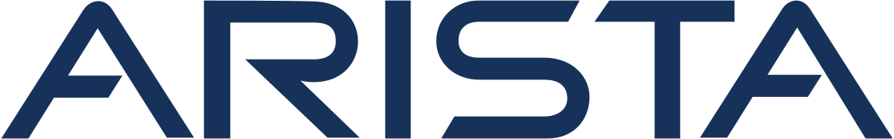
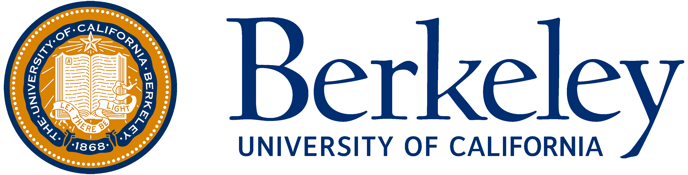

Hi, I'm Zhenzhong Tang, a Software Engineer at Arista Networks and a former Computer and Information Science (CIS) master's student at the University of Pennsylvania. My passion lies in building robust, high-performance systems. At Arista, I work on the Extensible Operating System (EOS), developing hitless restart features for minimal downtime and optimizing data center networking with VXLAN.

Previously, at Amazon and Western Digital, I optimized large-scale ML systems for ad recommendations and firmware performance. I also had some hands-on cloud admin experience with Docker and Kubernetes on my VPS and home server.

Always eager to tackle challenging problems and learn new skills!

## Work Experience




  

  
  
    Feb. 2024 - present
  
  

  
Software Engineer, Extensible Operating System (EOS)

  
Developing hitless restart redundancy feature and VXLAN (Virtual eXtensible Local Area Network) feature for data center networking.




  

    
    
      Sept. 2022 - Dec. 2022
    
  

  
Software Development Engineering Intern, Ads ML System

  
Contributed to low-latency machine learning remote inference service deployment, especially in testing and monitoring.




  

    
    
      Sept. 2022 - Dec. 2022
    
  

  
Software Engineer Intern, Data Center HDD Firmware

  
Focused on the enhancement of track density and reduction of data error rates for data center HDDs.





## Education




  

    
    
      Aug. 2021 - Dec. 2023
    
  

  
Master of Science in Engineering in Computer and Information Science




  

    
    
      Sept. 2017 - June 2021
    
  

  
Bachelor of Engineering in Computer Science and Technology




  

    
    
      Aug. 2019 - May 2020
    
  

  
Visiting Student in Electrical Engineering and Computer Science





<!-- ## Projects -->
