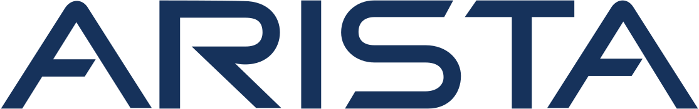

我叫汤振中，目前在Arista Networks做一名软件工程师，曾就读于宾夕法尼亚大学计算机与信息科学（CIS）硕士项目。我对构建“鲁棒”且高性能的系统很感兴趣。在Arista Networks，我参与了Extensible Operating System（EOS）网络操作系统的开发，负责实现Hitless Restart无缝重启功能以最小化丢包和停机时间，同时优化VXLAN技术以更好服务数据中心网络需求。

此前，我有幸在Amazon和Western Digital实习，并积累了丰富的开发经验。主要负责优化机器学习推理系统，以提升广告推荐模型处理量和速度。此外，我还在个人VPS和家庭服务器上实践过Docker与Kubernetes的云端管理经验。

不断学习，乐于挑战，无限进步！

## 工作经历




  

  
  
    2024/02 - 至今
  
  

  
程序猿, Extensible Operating System（EOS）开发

  
为数据中心网络交换机系统开发Hitless Restart（无缝重启/零宕机）功能和VXLAN（虚拟可扩展局域网）功能。




  

    
    
      2022/09 - 2022/12
    
  

  
实习程序猿，广告推荐机器学习推理系统开发

  
参与低延迟机器学习远程推理服务的开发，单独负责测试与可视化监控。




  

    
    
      May 2022 - Aug. 2022
    
  

  
实习程序猿，数据中心机械硬盘固件开发

  
主要负责硬盘固件优化，着重于磁道密度提升和数据错误率降低的相关工作。





## 教育经历




  

    
    
      2021/08 - 2023/12
    
  

  
计算机科学 硕士




  

    
    
      2017/09 - 2021/06
    
  

  
计算机科学 学士




  

    
    
      2019/08 - 2020/05
    
  

  
电子工程与计算机科学 交换生





<!-- ## Projects -->
