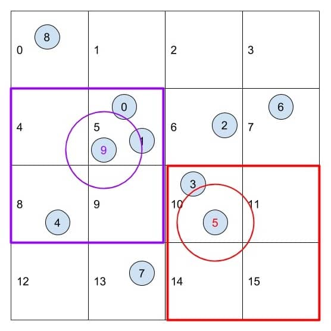



<!-- ## Introduction -->

 @ 2.44GHz 28GiB, Tesla T4 16GiB (Azure)")

This is a CUDA-based coherent uniform grid search implementation of the [Boids](https://en.wikipedia.org/wiki/Boids) flocking simulation algorithm. The algorithm, developed by Craig Reynolds in 1986, simulates the flocking behavior of birds. The goal of this project is to implement the algorithm with CUDA in different ways and optimize performance.

## Implementation

### Naive

A simple implementation of the algorithm is to iterate through each boid and calculate the updated velocity and position based on [three rules](http://www.vergenet.net/~conrad/boids/pseudocode.html):

- **Separation**: steer to avoid crowding local flockmates
- **Alignment**: steer towards the average heading of local flockmates
- **Cohesion**: steer to move towards the average position (center of mass) of local flockmates

Even with CUDA, this method is SOOOO slow that it can barely run with more than 50,000 boids. Because each boid needs to check the position of every other boid. \\(O(n^2)\\) global memory access causes our program to be heavily ***memory-bounded***.

### Scattered Grid Search

To avoid checking every other boids in the simulation, we can use a uniform grid to divide the space into cells. Each boid is assigned to a cell based on its position. Then, we only need to check the boids in the same cell and its neighboring cells.

 


The images show a simplified version in 2D plane, with grid cell width equals to 2 times the maximum search radius. Each boids would only need to check at most 4 neighbor cells (or in 3D case, 8 neighbor cells). This significantly reduces the number of global memory access.

### Coherent Grid Search


We can store the sorted position and velocity of boids based on cell indexes, so that boids data are contiguous in memory from the perspective of grid cells. The specific implementation eliminates an overhead associated with fetching a pointer index from global memory to access the position and velocity of boids in global memory. Interestingly, one parallelizing sort is considerably faster than the cost of random fetches of global memory. Also, ***coalesced*** memory access benefits more from cache and compiler optimizations.

## Performance Analysis

We can use average Frames Per Second (FPS) to compare the performance of different implementations. If not otherwise specified, the tests are conducted on a machine with Windows 11 Pro 22H2, AMD EPYC 7V12 64-Core Processor (4 vCPU cores) @ 2.44GHz 28GiB, Tesla T4 16GiB (Azure). CUDA block size is set to 128.

### Number of Boids


We see the performance of naive implementation is worse than grid searches. The coherent grid search implementation is the fastest, with a 3x speedup compared to the naive implementation with 5,000 boids. With more boids, we see more significant speedup. The coherent grid search is even 10x faster than the scattered grid search in 500,000 and 1,000,000 boids tests.

Though with visualization on, the peek performance of the coherent grid search is lower than turning off the visualization. It could be argued that the visualization is the bottleneck, but the performance of the coherent grid search is still better than others.

### CUDA Block Size


Selecting an appropriate block size is crucial to effectively utilize the available resources on the GPU, ensuring that all Streaming Multiprocessors (SMs) are actively engaged, and there are enough warps to hide memory access latencies. But in our tests, we didn't see significant difference in performance with different block sizes. All there implementation tend to perform a bit worse when block size is too large, like 1024, or too small, like 16.

### Fine-Grained Cells, 8 v.s. 27 Neighbors


We see even more improved results when we set the grid cell width to 1 times the maximum search radius, so that each boid would need to check at most 27 neighbor cells. With fine-grained search, the coherent grid search is more than 5x faster than the 8-cell coherent grid search in 500,000 and 1,000,000 boids tests. This is huge improvement. To put it more intuitively, see the stacked comparison.


27-cell coherent grid search in 500,000 and 1,000,000 tests is dominating the others.

### Profiling
1. **Scattered Grid Search v.s. Coherent Grid Search**: Current(blue) is the coherent grid search, and baseline(green) is the scattered grid search.


2. **27-cell Coherent Grid Search and 8-cell Coherent Grid Search**: Current(blue) is the 27-cell coherent grid search, and baseline(green) is the 8-cell coherent grid search.


## Q&A

<h4>For each implementation, how does changing the number of boids affect performance? Why do you think this is?</h4>

*With more boids, all three implementations perform worse. This is because with more boids, there are more things to sort, more memory access, more thread/warp/block management, and more computation.*

<h4>For each implementation, how does changing the block count and block size affect performance? Why do you think this is?</h4>

*Changing the block size has a relatively minor impact on the results, with only slight decreases in performance observed when block size is 16 (too small) or 1024 (too large). This limited effect can be attributed to the fact that the fundamental thread scheduling is managed by a "warp" of 32 threads.*

<h4>For the coherent uniform grid: did you experience any performance improvements with the more coherent uniform grid? Was this the outcome you expected? Why or why not?</h4>

*The coherent grid search is faster than the scattered grid search, especially when the number of boids is huge. I didn't expect to see such big leap. I think this is because the coherent grid search has better memory access pattern, and the overhead of sorting is less than the overhead of global memory access.*

<h4>Did changing cell width and checking 27 vs 8 neighboring cells affect performance? Why or why not?</h4>

*Yes, using 27 neighbor cells improved the performance by quite a lot. On one hand there are more cells to search, but on the other hand, the search is more accurate, so that we can avoid checking boids that are not in distance from the current boid, which results in less global memory access. This is especially useful when the number of boids is large. All in all, our program is still **memory-bounded**.*

## References

```
1. https://en.wikipedia.org/wiki/Boids
2. http://www.vergenet.net/~conrad/boids/pseudocode.html
```


