

大型语言模型 (LLM) 推理引擎自 2023 年 12 月 11 日起在 [llm.toytag.net](https://llm.toytag.net) 上线，并向公众开放一天。它包含了许多数学和工程技巧，使得高效托管成为可能，并使模型能够了解最新的 CIS 565 GPU 编程课程信息（甚至包括这个特定的项目）。欢迎试用！

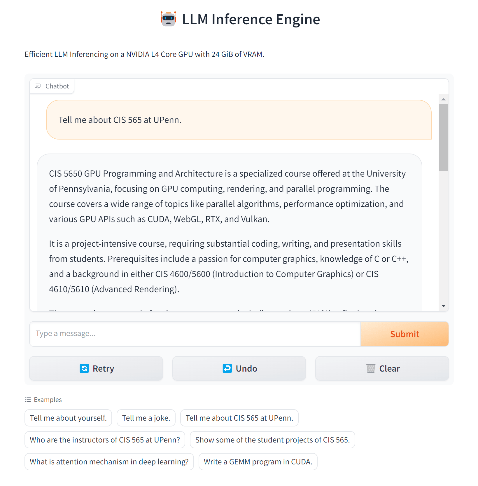

推理服务运行在一块单独的 NVIDIA L4 Tensor Core GPU 上，拥有 24 GiB 的 VRAM，并且耗电量不超过75W。这个大型语言模型是以 [Mistral-7B](https://huggingface.co/mistralai/Mistral-7B-v0.1) 为基础模型微调而来的 [Intel Neural Chat](https://huggingface.co/Intel/neural-chat-7b-v3-1) 模型，拥有70亿参数，同样也是一种GPT风格的语言模型。该服务占用超过 20 GiB 的 VRAM。在这块 GPU 上能够运行的最大模型大约是70亿参数，这是不损失任何精度的极限。

此仓库包含了我们对 Flash Attention 及其变体的实现。LLM推理服务的代码是从 vLLM 项目分叉而来，我们加入了**自定义内核**、**前端**以及 **docker build & compose**，以便于无忧部署。服务项目作为当前仓库的一个git子模块呈现，或者你可以直接访问[此链接](https://github.com/toytag/vllm/tree/8e41936777ea375e4cd4f463249f0870bbb5f06a)。

## 性能优先

我们首先展示这个项目最重要部分的性能提升和性能分析。要了解有关项目和LLM推理流程的更详细介绍，请参阅[背景](#背景)章节及其后续内容。

### 首个词元延迟（First Token Latency）

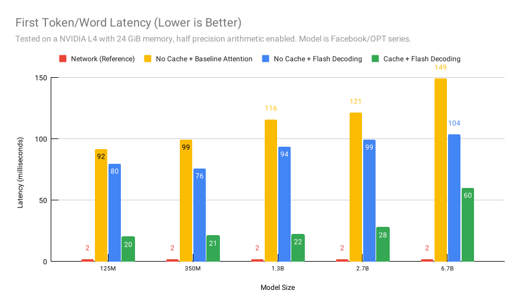

这里我们测试LLM服务过程中首个词元/单词生成的延迟。延迟是以毫秒为单位测量的，从用户发送生成请求的时刻开始，直到首个词元生成并发送回用户的时刻为止。红色条形代表发送到服务的类似大小的网络包，用于测量基础网络延迟。黄色条形是我们禁用缓存且使用简单关注力内核时的情况。蓝色条形是我们切换到闪速解码内核时的情况。最后，绿色条形是我们启用缓存时的情况。这种缓存与光线追踪中使用的“首次路径缓存”非常相似，通过复用之前的中间结果。这里是否有缓存分页并不重要。

网络延迟与生成时间相比微不足道。随着模型大小的增加，缓存的效果减弱，而来自 flash decoding 的加速开始显现。当模型大小过大时，内存成为瓶颈，所以缓存帮助不大。然而，闪速解码可以在计算 softmax 时减少内存访问，从而带来更显著的加速效果。

### 吞吐量（Throughput）

> 注意：吞吐量涉及多种因素，不同设置下会有显著变化。以下结果仅供参考。

吞吐量是通过计算长时间内每秒生成的平均词元数来衡量的。它是一个端到端的性能指标，涉及多种因素，包括网络延迟、模型、批处理策略，以及最后的关注力内核。红色条形是从HuggingFace 测得的吞吐量，黄色是来自 Microsoft 的 DeepSpeed，蓝色和绿色是基于 vLLM 的不同关注力内核。

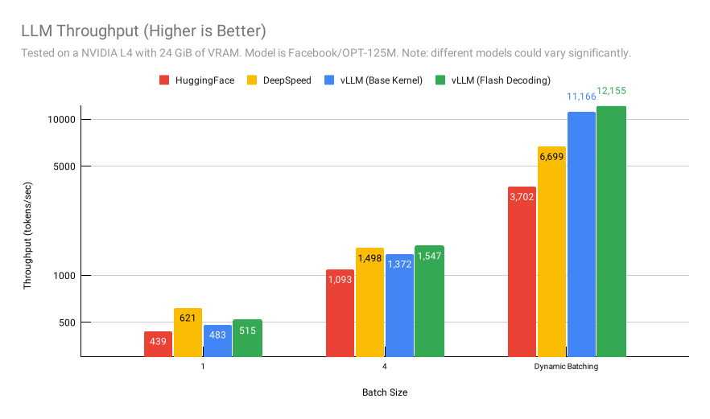

如图所示，内核本身对性能的影响并不显著。但一个普遍趋势是，flash decoding 比基础attention 内核更快。至少我们知道 DeepSpeed 拥有 flash decoding 和更多优化。考虑到每个框架实现的批处理策略和其他技巧的影响，当批处理大小较小时，内核性能比较更为明显。DeepSpeed 确实有更好的内核实现，但其“动态拆分-合并”批处理可能在批处理大小较大且上下文较短时造成开销，导致其峰值吞吐量低于vLLM。

在另一种设置中，使用 Mistral-7B 模型、32k 上下文长度和动态批处理，DeepSpeed 领先并实现了我们自定义 vLLM 性能的 2 倍。

| 框架 | 吞吐量 (词元/秒) |
| :-: | :-: |
| vLLM (基础内核) | 1067 |
| vLLM (Flash Decoding) | 1130 |
| **DeepSpeed** | **2082** |

HuggingFace 未能在此设置下运行吞吐量测试，可能是由于内存限制和其缓存策略不佳（内存碎片化导致推理时内存使用量大增）。这一发现进一步证明，内核并非推理服务性能的唯一决定因素。每个框架实施的批处理策略、缓存和其他技巧也起到了重要作用。

### 内核性能分析

总体而言，优化后的快速解码内核在计算和内存吞吐量方面优于基准注意力内核。两个内核均已尽可能优化，且 NSight Compute 没有显示任何一个内核中的共享内存银行冲突。通过几轮 warp/block 层级的 reduction 求和，对 matmul 加上 softmax 进行分块，是计算注意力和避免银行冲突最简单也是最高效的方法。

由于 Flash Decoding 在小批量和长上下文中表现出色，因此我们以批量大小为 1 和上下文长度为 4096 来分析基准注意力和推理服务中使用的 Flash Decoding。结果如下所示，**基准Attention内核显示为绿色，Flash Decoding 内核显示为蓝色**。

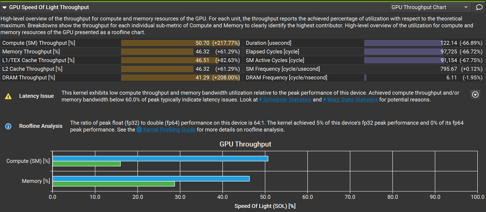

Flash Decoding 在计算吞吐量上提供了 2 倍的加速，在内存吞吐量上提供了 50% 的加速。这是一个非常令人兴奋的初步洞见！

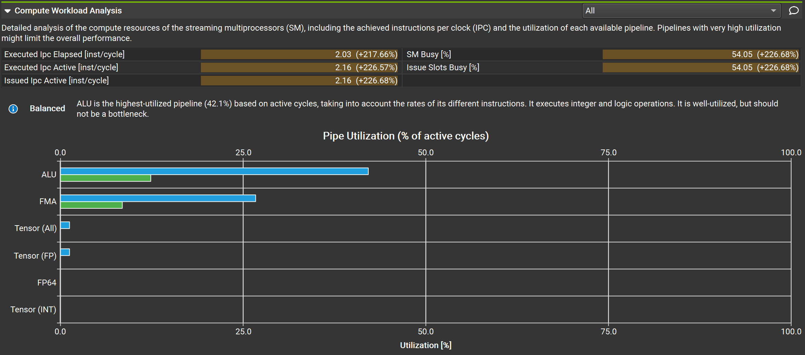

我们优化后的 Flash Decoding 版本使用了半精度浮点数（FP16），尝试在一条指令中融合两个浮点数计算。并且，通过大量融合的乘加（FMA）指令，该内核实现了更好的计算吞吐量。我们甚至在计算工作负载分析中加入了一些内联 PTX 代码，利用 Tensor Core 进行小型矩阵乘加。

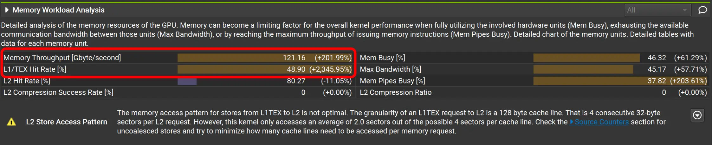

通过更多的 warp 尝试从全局内存中获取数据，内存吞吐量也得到了提升。我们还有更好的机会通过更多的 warp 调度来“隐藏”全局内存访问的延迟。L1 缓存命中率提高了 20 多倍。我们认为这与 Flash Decoding 的工作分区有关。每个线程处理的数据块更小（局部性更强），且数据更有可能被同一 warp 中的其他线程重用。因此，L1 缓存效果大大提高。尽管完整报告过于冗长，无法在此处包含，但我们确实想指出 NSight Compute 显示共享内存 bank 冲突鲜有改进空间，这表明在共享内存访问方面达到了最优。

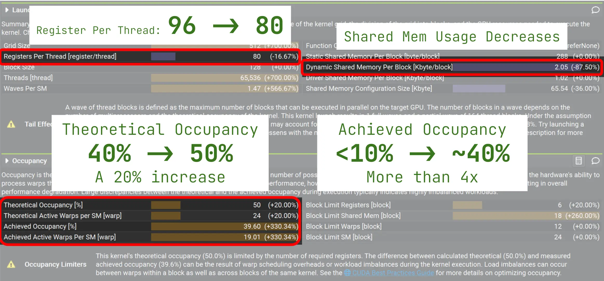

如启动统计数据所示，我们优化后的 Flash Decoding 每个 thread 使用 80 个寄存器，而基准版本使用 96 个。这导致了更多的性能提升，并且通过牺牲内核通用性（即，放弃支持某些特殊的注意力和模型）可以进一步优化。从占用率信息中，我们看到高寄存器使用率是低占用率的主要原因。通过我们的优化，理论上的占用率从约 40% 提高到 50%，增加了 20%。实际达到的占用率增加了超过 300%，使我们能够实现更好的 GPU 利用率。

## 背景

像 ChatGPT 或 Llama 这样的大型语言模型（LLM）最近引起了广泛关注。然而，运行它们仍然相当昂贵。在 AWS 上使用 8x A100 实例生成单个回应的费用，目前可能约为每次简短交互 0.01 美元，考虑到每天有数十亿用户进行多次互动，这笔费用可以变得相当可观。某些任务，如每输入一个新字符就激活的代码自动补全，尤其是资源密集型的。随着 LLM 越来越多地应用于各种场景，即使是生成效率的微小改进也能导致显著的总体成本降低。

我们的目标是研究并整合用于 LLM 推理的高级加速方法。我们计划使用 GPU 基准测试来评估这些方法，并从几篇关键论文和博客中获取洞见：

1. **[FlashAttention: Fast and Memory-Efficient Exact Attention with IO-Awareness](https://arxiv.org/pdf/2205.14135.pdf)**
2. **[FlashAttention-2: Faster Attention with Enhanced Parallelism and Work Partitioning](https://arxiv.org/pdf/2307.08691.pdf)**
3. **[PagedAttention: Optimized Memory Management in LLM Serving with PagedAttention](https://arxiv.org/pdf/2309.06180.pdf)**
4. **[Flash-Decoding for long-context inference](https://crfm.stanford.edu/2023/10/12/flashdecoding.html)**
5. **[FlashDecoding++: Accelerated Large Language Model Inference on GPUs](https://arxiv.org/pdf/2311.01282.pdf)**

我们的最终目标是综合这些研究中的最佳特性，以创造出一种创新性的、更高效的推理算法。

## LLM 推理流程

传统的 LLM 解码算法严重依赖于注意力机制。虽然这一机制对模型的有效性至关重要，但它也是 LLMs 中计算效率低下的一个重要来源。LLM 推理流程总体上如下所示：

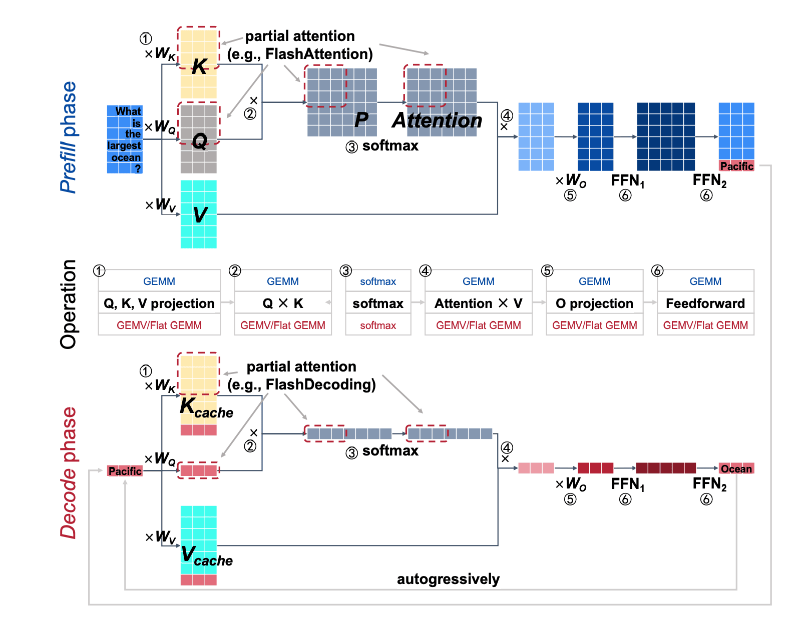

推理流程可以分为三个主要阶段：

1. **预填充**：在这一阶段，注意力机制生成初始令牌，并根据用户的输入查询建立键值（KV）缓存。这一阶段主要涉及通用矩阵乘法（GEMM）操作。

2. **键值（KV）缓存**：KV 缓存在存储键和值矩阵方面发挥着关键作用。这些矩阵至关重要，因为它们有助于在解码阶段最小化重复计算。

3. **解码（Decoding）**：这个阶段涉及另一个注意力机制，负责生成后续令牌并根据用户的输入查询更新 KV 缓存。主要操作包括通用矩阵-向量（GEMV）和扁平化 GEMM。

为了优化 LLM 推理流程，关键是要专注于提升这三个组成部分。这从深入理解注意力机制和 KV 缓存的复杂性开始。

---

### LLM 推理中的注意力机制

根据 LLM 推理流程的概述，一个需要优化的关键组件是注意力机制。注意力机制在神经网络中占据主导地位，尤其是在自然语言处理（NLP）任务中，类似于人类的选择性注意力。它选择性地集中于输入序列的特定部分，以构建输出的每一部分。这种动态聚焦对于高效处理和语境化长序列至关重要。

LLM 内部的自注意力机制由以下公式控制：

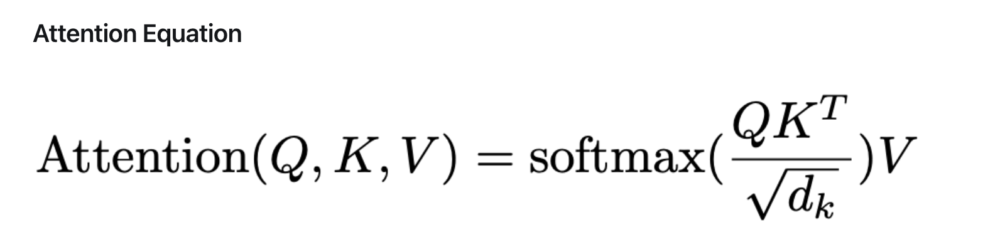

在这个公式中：
- `Q` 代表查询（Query）矩阵。
- `K` 表示键（Key）矩阵。
- `V` 是值（Value）矩阵。

注意力机制主要分为两个步骤：
1. **注意力分数计算**：首先，通过将查询（`Q`）矩阵与键（`K`）矩阵相乘来确定注意力分数。这些分数量化了应该分配给输入序列各部分的关注度。
2. **加权求和生成**：随后，利用这些注意力分数通过与值（`V`）矩阵相乘来计算加权求和。这产生了输出，即经过注意力分数调整的输入的精炼综合。

这个机制是 LLM 推理流程的“预填充”和“解码”阶段不可或缺的一部分。提高其效率至关重要，因为它直接影响模型的计算需求和生成输出的质量。

---

### KV 缓存

键值（KV）缓存也是 LLM 推理流程的一个重要组成部分，特别是在注意力机制的背景下。KV 缓存作为存储键（`K`）和值（`V`）矩阵的机制，这些矩阵是注意力机制计算的核心。

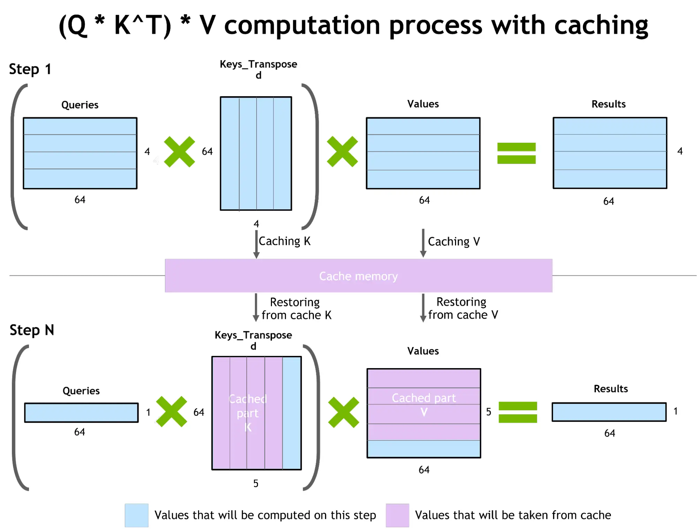

如图所示，一旦计算出 K 和 V 矩阵，它们就被存储在缓存内存中，以便未来使用，避免重复计算。每生成一个新令牌，缓存就会更新，并使用更新后的矩阵来生成下一个令牌。这个过程持续进行，直到生成整个序列。

KV 缓存的效率直接影响 LLM 的性能。优化其存储和检索过程可以使模型推理更快、更节省资源。

---

在全面理解了注意力机制和 KV 缓存后，我们现在准备好探索 LLM 推理流程中每个步骤的优化策略。这一探索将专注于提高整个解码过程的效率和速度，从初始的预填充到最终的令牌生成。

## 预填充优化

### [FlashAttention-1](https://arxiv.org/pdf/2205.14135.pdf)

在 FlashAttention 开发之前，为了加速注意力过程，曾多次尝试通过减少每秒浮点运算（FLOPs）来实现。然而，这些方法在有效管理大规模 LLM 推理的需求方面不足。认识到这一差距，FlashAttention 的作者们引入了一个关键原则：使注意力算法具有输入/输出（IO）意识。这种方法涉及在各种内存层次之间（如快速的片上 GPU 静态随机存取存储器（SRAM）和相对较慢的 GPU 高带宽存储器（HBM））仔细平衡数据读写。

在现代 GPU 时代，计算速度通常超过内存速度，大多数注意力操作受到内存访问瓶颈的限制。传统的注意力机制通常涉及到 HBM 的八次读写操作。

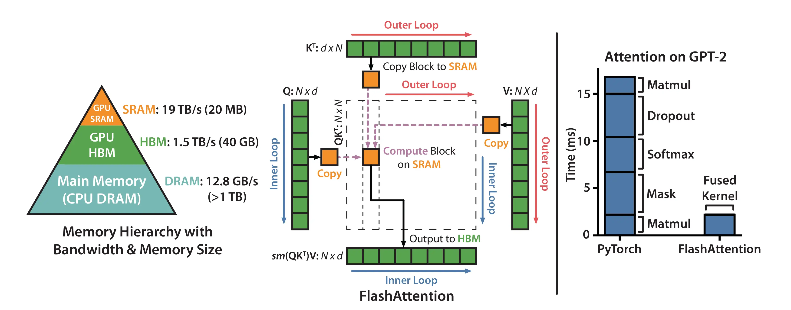

上图显示，SRAM 的读写速度远高于 HBM，尽管其存储容量显著较少。为了优化这一点，FlashAttention 引入了一种减少对 HBM 的读写操作的方法。它将参与计算的矩阵分割成小块，在 SRAM 中处理，从而提高了读写效率并减少了对 HBM 的依赖。该图也展示了 FlashAttention 算法，强调了其创新策略，如分块和 softmax 重缩放。此外，FlashAttention 使用融合内核方法来最小化内存访问，并进一步完善注意力过程。

要了解 FlashAttention 算法的全面细节，请参考[原始论文](https://arxiv.org/pdf/2205.14135.pdf)和 Aleksa Gordić 的深入解释性[博客文章](https://gordicaleksa.medium.com/eli5-flash-attention-5c44017022ad)。

---

### [FlashAttention-2](https://arxiv.org/pdf/2307.08691.pdf)

FlashAttention-2 在 FlashAttention-1 的基础上进一步提升性能，引入了关键的增强功能。这些改进重点在于优化 GPU 上的计算效率和并行处理能力。

* **减少非矩阵乘法 FLOPs**：更新后的算法最小化了非矩阵乘法（non-matmul）每秒浮点运算（FLOPs）。这一点至关重要，因为像 Nvidia 这样配备 Tensor Core 的现代 GPU 在矩阵乘法操作上非常高效。例如，A100 GPU 理论上可以执行每秒 312 TFLOPs 的 FP16/BF16 matmul，但只能执行每秒 19.5 TFLOPs 的非矩阵乘法 FP32 操作。本质上，每个非矩阵乘法 FLOP 的成本约为矩阵乘法 FLOP 的 16 倍。通过更多地关注矩阵乘法 FLOPs，FlashAttention-2 确保了更高的吞吐量。

* **增强的并行性**：原始的 FlashAttention 算法在批量大小和头数上并行化计算，每个注意力头使用一个线程块。当线程块总数（batch_size * 头数）较大时，这种方法能够最佳地利用 GPU 的计算资源，因而非常高效。然而，对于长序列（通常对应于较小的批量大小或较少的头数），新版本引入了对序列长度维度的额外并行化。这一变化显著提高了长序列场景下的性能。

* **改进的工作划分**：FlashAttention-2 还细化了每个线程块内的工作划分，分布在不同的 warp（32个线程的组）之间。原始版本通常每个线程块使用 4 或 8 个 warp。FlashAttention-2 中的修订划分减少了 warp 之间的同步和通信需求，导致共享内存的读/写次数减少，从而提高了总体效率。

下图比较了 FlashAttention-1 和 FlashAttention-2，展示了在并行性和工作划分方面的增强：

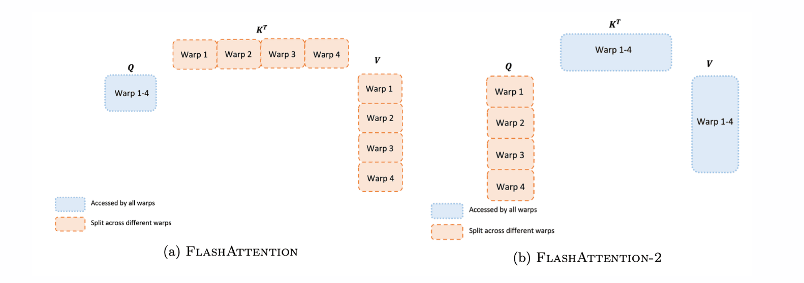

Tri Dao（FlashAttention-2 的作者）撰写的博客对算法及其增强功能进行了详细说明。欲了解更多信息，请参考[原始论文](https://arxiv.org/pdf/2307.08691.pdf)和[博客文章](https://crfm.stanford.edu/2023/07/17/flash2.html)。

## KV 缓存优化

### [PagedAttention](https://arxiv.org/pdf/2309.06180.pdf)

PagedAttention 代表了注意力算法的一次突破，它从操作系统中使用的虚拟内存和分页技术中汲取灵感。这种新颖的方法重新定义了大型语言模型中键值（KV）缓存的管理。

传统上，KV 缓存是在连续的内存空间中管理的，如下图所示。然而，PagedAttention 打破了这一常规，将 KV 缓存分割成离散的块。每个块保存一定数量令牌的注意力键和值，但与传统方法不同，这些块不是存储在连续的空间中。

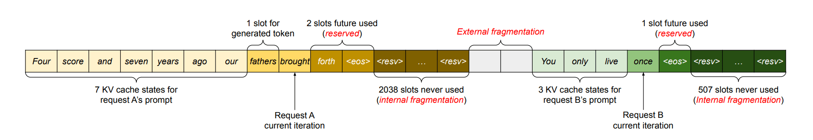

这种摒弃连续空间缓存的做法显著减少了 GPU 内存中的内部和外部碎片化。PagedAttention 方法反映了操作系统虚拟内存管理的灵活性，导致更有效的内存利用。因此，模型可以处理更大的批量大小，转化为 LLM 推理任务中更高的吞吐量，特别是对于涉及长序列的任务。

下图展示了 PagedAttention 算法。这种视觉表示突出了该算法在内存管理方面的独特方法，从根本上提高了大型语言模型推理的效率。

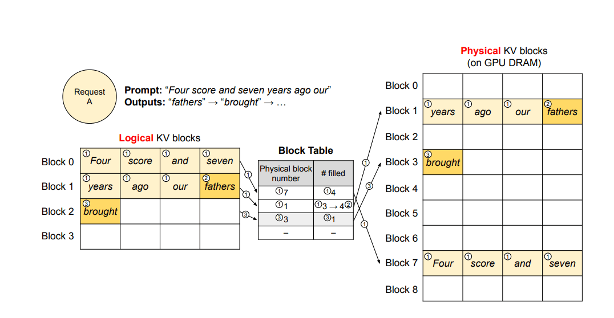

PagedAttention 的实现标志着在优化 KV 缓存方面的重大进步，有望提升大规模语言模型推理的可扩展性和效率。

## 解码优化

### [FlashDecoding](https://crfm.stanford.edu/2023/10/12/flashdecoding.html)

在 LLM 推理的解码阶段，每个新生成的令牌都必须关注所有前面的令牌。这就需要计算 `softmax(queries @ keys.transpose) @ values`，这个过程引入了独特的优化挑战。

虽然 FlashAttention 的第1版和第2版优化了预填充阶段的这一操作，主要是针对内存带宽瓶颈（例如，Q @ K^T），但这些优化并不直接适用于解码阶段。解码过程中的瓶颈是不同的。FlashAttention 通常在批量大小和查询长度维度上进行并行化。然而，在解码中，查询长度通常为 1。这意味着，如果批量大小小于 GPU 上的流处理器（SM）数量（例如，A100 上为 108），那么 GPU 就未能充分利用。长上下文的场景常见于此，这需要更小的批量大小以适应 GPU 内存限制。当批量大小为 1 时，FlashAttention 可能只能利用 GPU 容量的不到 1%！

Flash-Decoding 是 FlashAttention 的扩展，引入了一个新的并行化维度：键/值序列长度。它有效地结合了 FlashAttention 两个版本的优点。与前辈一样，Flash-Decoding 最小化了全局内存中额外数据的存储。关键的是，即使在批量大小较小的情况下，只要上下文长度足够长，它也能最大化 GPU 的利用率。

下面是展示 Flash Attention 和 Flash Decoding 之间差异的视觉对比：

#### Flash Attention

#### Flash Decoding

此外，Flash-Decoding 实现了跨键和值的并行化，尽管需要一个小的最终约简步骤。

Flash-Decoding 的操作主要包括三个步骤：

1. **分割键/值**：将键和值分割成较小的块。
2. **并行注意力计算**：使用 FlashAttention 并行计算查询与每个分割的注意力。这一步骤还涉及到每行和每个分割写入一个额外的标量：注意力值的 log-sum-exp。
3. **最终输出计算**：通过对所有分割进行约简，使用 log-sum-exp 值来缩放每个分割的贡献，从而得出实际输出。

这种方法利用了注意力/softmax 计算的迭代特性。Flash-Decoding 在两个层次上应用这一原则：在每个分割内（类似于 FlashAttention）和在最终约简中跨分割。

在实践中，步骤 (1) 不涉及 GPU 操作，因为键/值块只是完整张量的视图。然后，该过程分别使用两个不同的内核来执行步骤 (2) 和 (3)。

---

### [FlashDecoding++](https://arxiv.org/pdf/2311.01282.pdf)

尽管 Flash-Decoding 显著提高了 GPU 利用率，但在 softmax 值的计算方面仍有优化空间。在原始的 Flash-Decoding 算法中，softmax 计算需要从每个分数中减去最大的注意力分数值。由于跨键/值序列长度的并行化，每个分割的最大值是不同的。因此，需要存储每个分割的最大值，并使用同步来计算所有分割中的全局最大值。根据论文，这种部分 softmax 操作在注意力过程中引入了约 20% 的开销。

FlashDecoding++ 通过实现统一最大值方法来解决 softmax 计算中的这一挑战，有效地消除了同步的需求。

#### 不同 Softmax 实现的比较
下图展示了各种 softmax 实现之间的差异：

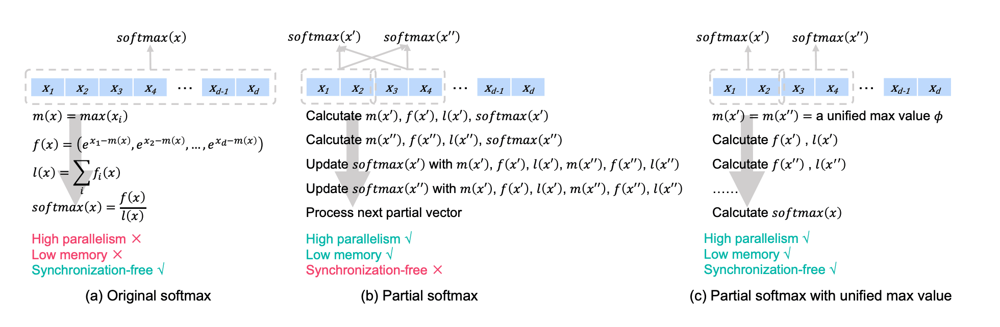

- 传统注意力使用标准 softmax 方法。
- FlashDecoding 使用部分 softmax，需要在不同的部分向量之间进行同步。
- FlashDecoding++ 采用具有统一最大值的部分 softmax，从而消除了同步的需求。

#### LLMs 中 softmax 输入向量元素的分布
softmax 输入向量元素在不同的大型语言模型中的统计分布是不同的。下图显示了各种 LLMs 的这种分布：

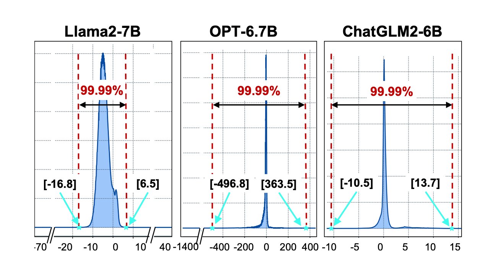

然而，如图所示，不同 LLMs 中元素的分布各异。这种变化意味着需要为每个特定的 LLM 手动调整最大值。对于像 OPT-6.7B 这样分布较广的模型，统一的最大值可能不是最有效的。因此，虽然 FlashDecoding++ 简化了 softmax 计算，但它也引入了模型特定调整的考虑因素。

## 参考资料

- **Accelerated Inference for Large Transformer Models Using NVIDIA Triton Inference Server**: [NVIDIA Developer Blog](https://developer.nvidia.com/blog/accelerated-inference-for-large-transformer-models-using-nvidia-fastertransformer-and-nvidia-triton-inference-server/)
- **FlashAttention Github**: [Github Repository](https://github.com/Dao-AILab/flash-attention)
- **FlashAttention-2 Blog**: [Stanford CRFM Blog](https://crfm.stanford.edu/2023/07/17/flash2.html)
- **Flash Attention Inference Github**: [Github Repository](https://github.com/Bruce-Lee-LY/flash_attention_inference)
- **vLLM Github**: [Github Repository](https://github.com/vllm-project/vllm)


&nbsp;

