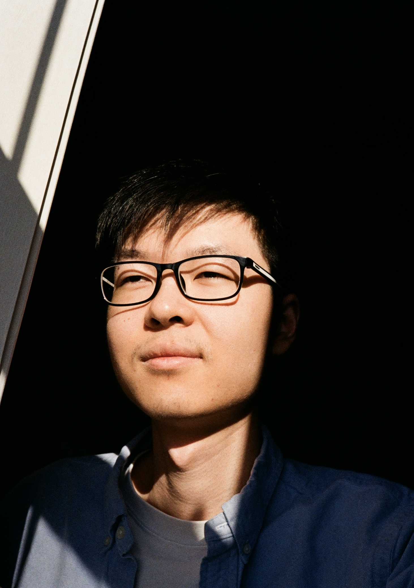
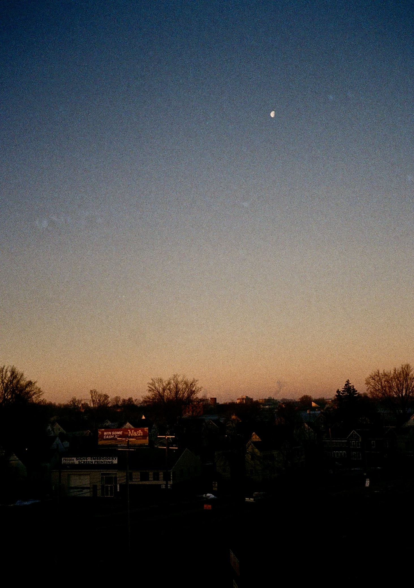
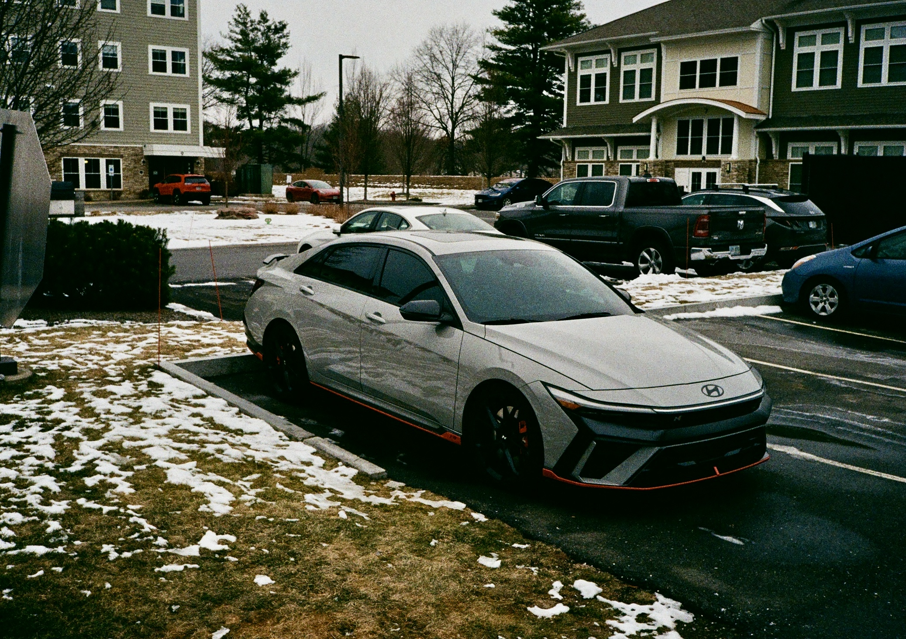
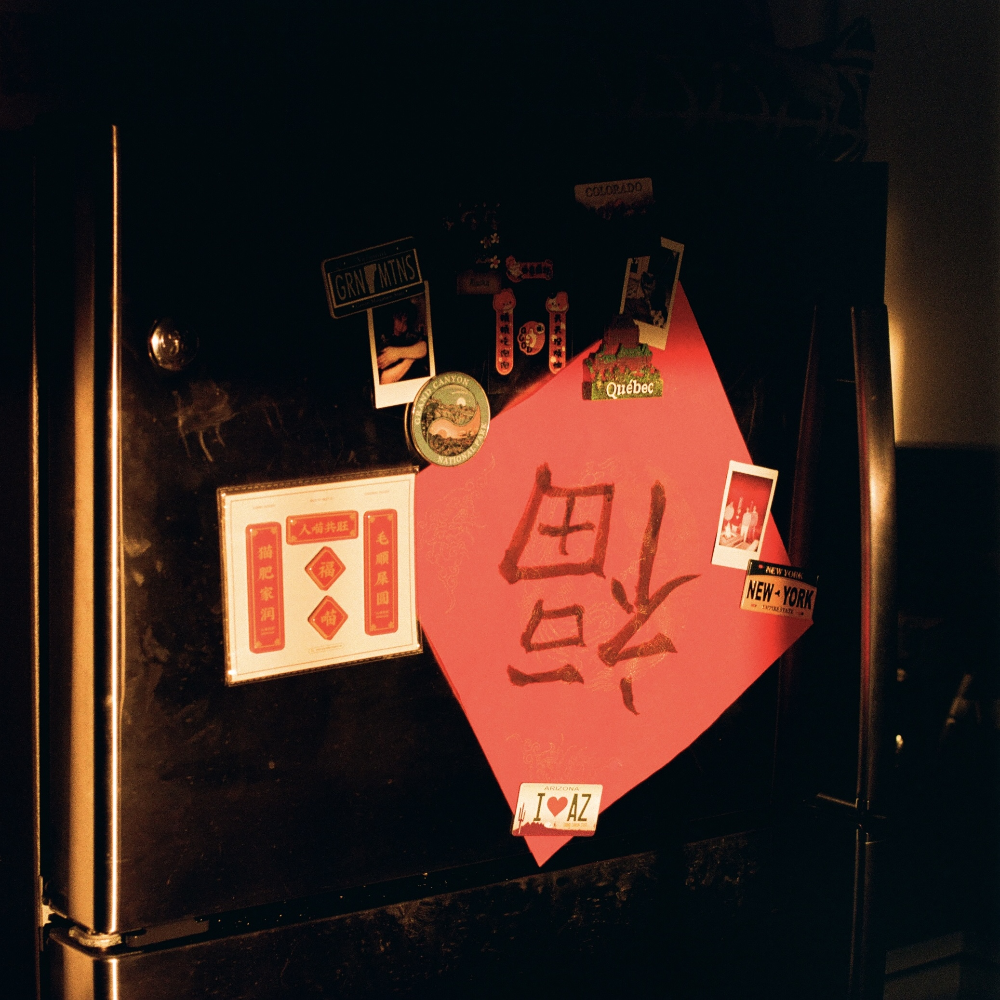

Kodak Gold 200 is a color negative film known for its warm, natural tones and moderate contrast—perfect for shooting in sunlight. Plus, it’s relatively affordable, making it beginner-friendly. 😎

This is my first experience with film stock, and shooting it with my Pentax 17 has been an absolute joy. I also have a Nikon FE, but it’s currently suffering from a light leak issue -- still lying on the operating table, waiting to be saved.

## Featured Photos


  
  
  
  
  
  
  
  
  
  
  
  
  


<!-- ## Shots with Pentax 17 -->

<!-- ## Shots with Nikon FE -->