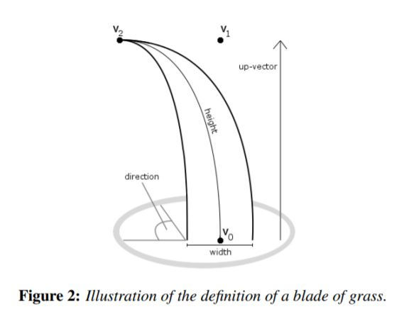
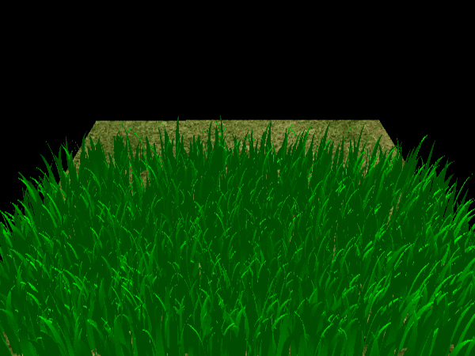

.")

## Physical Model

We consider three different natural forces in our blade model: recovery, gravity and wind.

- **Recovery**: The recovery force is the counter force to previously applied forces and it is directed to the initial pose of the grass.
- **Gravity**: The gravity force consist of two additive forces.
    - One force represents the gravity of the whole scene, i.e. *the environmental gravity*.
    - The other force is orthogonal to the width of the blade, i.e. *front gravity*.
- **Wind**: The wind force is a force that is applied to the blade in the direction of the wind.

After applied all the forces, we also need to validate the new states of our blades (to make sure they behave like a physically existed grass) and then get the final positions.

| Static | Physically Simulated |
| :-: | :-: |
|  |  |

## Culling

Culling is a rendering technique that removes objects that are outside of the view frustum or not visible. In this project, we use three different culling techniques to improve the performance of our grass rendering system.

- **Orientation Culling**: This test culls a blade based on its orientation towards the camera. Since the grass has no thickness, the blades that are approximately parallel to the viewing direction can be removed.
- **View-Frustum Culling**: This test culls a blade based on whether a blade is inside the camera's view frustum.
- **Distance Culling**: This test culls blades of grass according to their distance towards the camera.

From the demo in the overview section, we can most easily see the effect of view frustum and distance culling.

| No Culling | Culling |
| :-: | :-: |
|  |  |

## Performance Analysis

We mainly examine the performance of our grass rendering system with or without culling techniques and different number of blades.

We will use the average FPS from 10 seconds to measure the performance. Higher FPS means better performance.

From the provided trend, it's evident that as the number of blades increases, the frame rate linearly declines, regardless of whether culling is enabled or not. This is because the number of blades is directly proportional to the number of draw calls, which should be the main bottleneck of our rendering system in the ranges of number of blades we tested.

Implementing various culling techniques can enhance performance since there will be fewer blades to render. Orientation Culling provides consistent improvement across the board; View-Frustum is most effective when only a few blades are on-screen; Distance culling is optimal when the camera is positioned far from the grass. In our case, distance culling provides the best performance improvement in large number of blades. However, more comprehensive testing is needed to cover more corner cases.


