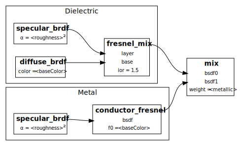



## 引言

路径追踪器是一种渲染技术，用于模拟场景中光线的行为。它采用蒙特卡洛方法通过追踪场景中的光线路径来估算每个像素的辐射强度。这种算法是迭代且并行的，因此在CUDA上运行直观且相当高效。它能够模拟其他渲染技术难以实现的多种效果，如柔和阴影、景深、焦散、环境遮蔽和间接照明。

|||
| :-: | :-: |
| **咖啡店** | **斯坦福兔子** |
|  |  |
| **奶牛** | **齿轮** |
|  |  |

上述所有场景均以2000x2000分辨率渲染，每像素1000样本和8次光线反射。

还有一个有趣的镜面场景，其中一个光滑的球体被放置在一个所有面都是镜子的立方体中，以2000x2000分辨率渲染，每像素200样本，并且光线反射次数不同。

| 1次光线反射 | 8次光线反射 | 64次光线反射 |
| :------: | :-------: | :--------: |
|  |  |  |

## 视觉特性

### 材质系统

材质系统采用了 [glTF规范](https://registry.khronos.org/glTF/specs/2.0/glTF-2.0.html#appendix-b-brdf-implementation)。

- **反照率**：材质的颜色。
- **金属度**：漫反射和镜面反射的比例。`0`值意味着材质是电介质，`1`值则表示材质是金属。
- **粗糙度**：材质的粗糙程度。`0`值表示材质完全光滑，`1`值则表示材质是纯粹的漫反射。
- **折射指数**：材质的折射指数。`1`值表示材质是真空，而`1.5`值对大多数不透明的电介质材质来说是一个很好的折中选择。
- **不透明度**：材质的不透明度。`0`值表示材质完全透明，`1`值则表示材质完全不透明。
- **发射度**：材质的发射度。`0`值表示材质不发光，大于`0`的值则表示材质发光，控制材质的亮度。

通过调整`金属度`和`粗糙度`参数，材质可以是电介质或金属，其反射模型可以是漫反射或镜面反射。结合多重重要性采样，路径追踪器能够渲染出不完美的镜面材质，并产生更好的粗糙效果。此外，通过控制电介质的`折射指数`和`不透明度`，材质可以产生类似玻璃的折射效果并带有菲涅尔效应。

|| 漫反射表面 | 非完全光滑 | 完全光滑 |
|:-| :----------: | :-----------: | :----------------: |
|
**电介质**
|  |  |  |
|
**金属**
|  |  |  |
|
**玻璃**
|  |  |  |

利用材质系统，我们可以模仿许多真实世界的材质。例如，我们有如铝、钛、不锈钢以及各种不同玻璃等材质。

| 更多金属 | 更多玻璃 |
| :----: | :---: |
|  |  |

以及更多不同材质的 Suzanne

| 玻璃 | 铝合金 | 黄色塑料 | 不锈钢 |
| :----: | :---: | :---: | :---: |
|  |  |  |  |

所有场景都以800x800的分辨率、2000样本每像素（spp）和8次光线反弹进行渲染。

### 抗锯齿

通过在像素内抖动光线，可以实现抗锯齿。在以下示例中，图像以低分辨率渲染以夸大效果。

| 关闭抗锯齿 | 开启抗锯齿 |
| :----: | :---: |
|  |  |

所有场景都以200x200（上采样到800x800）的分辨率、2000样本每像素（spp）和8次光线反弹进行渲染。

### 基于物理的景深

通过在光圈内抖动光线，可以实现景深。在以下示例中，光圈被模拟为半径为0.5的圆，焦距为10。

| 关闭景深 | 开启景深 |
| :-----: | :----: |
|  |  |

所有场景都以800x800的分辨率、2000样本每像素（spp）和8次光线反弹进行渲染。

### 网格加载

借助 [tinyobjloader](https://github.com/syoyo/tinyobjloader) 和 [tinygltf](https://github.com/syoyo/tinygltf/) 库，路径追踪器能够加载`.obj`和`.gltf`文件（部分）。因此，我们可以渲染更复杂的场景，并对路径追踪器施加更大的压力。

### 程序化纹理

通过使用交点的重心插值uv坐标，可以实现程序化纹理。几乎没有性能影响。请查看以下示例。

| 渐变马里奥 | 棋盘马里奥 |
| :-----: | :----: |
|  |  |

所有场景都以800x800的分辨率、1000样本每像素（spp）和8次光线反弹进行渲染。

### 图像降噪

[Open Image Denoise](https://www.openimagedenoise.org/) 是一个用于光线追踪的高性能、高质量的降噪库。它能够在不丢失太多细节的情况下去除渲染图像的噪声。额外的过滤器，如反照率和法线图，被添加到降噪器的预过滤器中，以提高降噪图像的质量。

降噪器被集成到系统中作为一个后处理步骤。在每个固定数量的间隔触发，降噪图像使用指数移动平均数合并到原始图像。

$$ \text{Image} = (1 - \alpha) * \text{Image} + \alpha * \text{Denoised} $$

尽管它对性能有一点影响，但图像的质量显著提高，我们可以用更少的样本数量得到更清晰的图像。

以下示例显示了每像素200个样本的降噪器效果，这是一个相对较低的采样率。

| 关闭降噪器 | 开启降噪器 |
| :----------: | :---------: |
|  |  |

所有场景都以800x800的分辨率、200样本每像素（spp）和8次光线反弹进行渲染。

## 性能特性

### 流压缩

当一条光线击中光源、进入虚空或超过最大反弹次数时，它会被终止。使用流压缩从光线池中移除已终止的光线。幸运的是，流压缩算法已经在 [CUDA Thrust](https://docs.nvidia.com/cuda/thrust/index.html) 库中实现，我们可以使用`thrust::remove_if`或在这种情况下使用`thrust::partition`从光线池中移除已终止的光线。任何自定义的工作效率流压缩实现，具有共享内存优化和避免银行冲突，例如 [Project2-Stream-Compaction](https://github.com/toytag/Project2-Stream-Compaction)，都可以很好地完成这项工作。



## 性能特性

### 首次反射缓存

当未启用抗锯齿时，来自相机的第一条光线在每次迭代中总是相同的。因此，我们可以缓存第一次反射的光线，并在每次迭代中重复使用它。然而，当启用了更先进的视觉特性，如抗锯齿、景深和运动模糊时，这种优化并不特别有用。

### 材质排序

此外，我们可以通过材质类型对光线进行排序以提高性能。思想是，具有相同材质类型的光线将具有相似的处理时间，以便我们可以减少线程束的发散。然而，这种优化后来证明并不是很有用，甚至对性能有害。原因是排序过程本身相对于性能提升来说非常昂贵。没有显著的性能提升可以抵消成本。

### 包围体层次结构

包围体层次结构（Bounding Volume Hierarchy，BVH）是一个在场景几何体上的树结构，用于加速光线追踪。其思想是将场景几何体分组到包围体的层次结构中，如果光线与包围体没有交叉，光线追踪器可以快速丢弃整个原始体组。

[PBRT 4.3](https://pbr-book.org/3ed-2018/Primitives_and_Intersection_Acceleration/Bounding_Volume_Hierarchies)的图片很好地说明了BVH的真实情况。BVH使用等量划分方法构建，该方法试图将原始体划分为两个等量的组。BVH在CPU上构建（在一个线性缓冲区（堆结构）中），然后复制到GPU进行光线追踪。通过利用SAH（Surface Area Heuristic）和在GPU上直接构建BVH，可以对BVH进行优化。

## 性能分析

让我们看一下启用不同特性的路径追踪器的性能。除了其性能优势外，流压缩在算法的正确性中也起着重要作用。因此，所有的测试都将启用流压缩，我们将使用只启用流压缩方法的路径追踪器作为基准。

.svg)

Cornell-Metal和Cornell-Glass是在cornell盒子里有金属或玻璃材质的球的简单场景。这些球并不在网格系统中，因此BVH对性能没有影响。

更复杂的场景，如Mario-Metal和Mario-Glass，与前两个场景相同，只是将球体替换为Mario网格。网格系统能够加载`.obj`文件或`.gltf`文件（部分）。Mario网格中的三角形数量约为5,000。

最后，Teapot-Complex场景由5个具有不同材质的茶壶组成。茶壶是从`.obj`文件中加载的。茶壶在场景中均匀放置，总的三角形数量约为50,000。

### 观察

- **材质排序**并不是一个好的优化。它减慢了路径追踪器的速度。原因，如前所述，是排序过程本身相对于性能提升来说非常昂贵。没有显著的性能提升可以抵消成本。
- **首次反射缓存**的性能提升有限。原因是第一次反射只是整个光线追踪过程的一小部分。此外，当启用更先进的视觉特性，如抗锯齿、景深和运动模糊时，每次迭代的第一次反射不再相同。
- **BVH**令人震惊。它能够将性能提高15倍，减少90%的渲染时间！BVH使得如果光线没有与包围体相交，就可以快速丢弃原始体组。这在场景复杂、原始体数量大的情况下特别有用。尽管BVH遍历需要额外的全局内存访问，但性能提升仍然显著。

### 可能的改进

- 表面下散射
- 波长依赖的折射
- 体渲染
- 纹理和法线贴图
- 运动模糊
- 环境贴图
- 更好的随机数生成器
- 使用SAH的BVH和GPU上的BVH
- 占用率优化
- 共享内存优化

## 参考资料
1. [Physically Based Rendering: From Theory To Implementation](https://pbr-book.org/)
2. [glTF Specification and Example BxDF Implementation](https://registry.khronos.org/glTF/specs/2.0/glTF-2.0.html#appendix-b-brdf-implementation)
3. [GPU-based Importance Sampling](https://developer.nvidia.com/gpugems/gpugems3/part-iii-rendering/chapter-20-gpu-based-importance-sampling)
4. [Axis-Aligned Bounding Box (AABB) intersection algorithm](https://tavianator.com/2011/ray_box.html)
5. [Iterative BVH Traversal with near \\(O(1)\\) Memory](https://developer.nvidia.com/blog/thinking-parallel-part-ii-tree-traversal-gpu/)
6. [Open Image Denoise](https://www.openimagedenoise.org/)


