


Enabling a 6-joint robotic arm to draw portraits.


, Teng Xu, Ganlin Zhang, Ziyuan Hu, Weijie Lyu")

## Quick Demo



## Vision

The goal of vision algorithm is to find a path, a sequence of 2d points, by following which the robot arm could draw a portrait.

Our image processing pipeline:

1. CNN Face Detection (A face crop with size 256x256 is produced)
2. Canny Edge Detection (Extract all the edge points in the image)
3. Minimum Spanning Tree + Depth-first Search (Generate a path that traverses all the edge points)
4. Ramer-Douglas-Peucher Downsampling (Use RDP downsampling method to reduce noise)

### CNN Face Detection

We trained a custom CNN for semantic human matting.

Our network design and training is based on three papers below:
- [U-Net: Convolutional Networks for Biomedical Image Segmentation](https://www.google.com/url?q=https%3A%2F%2Farxiv.org%2Fabs%2F1505.04597&sa=D&sntz=1&usg=AOvVaw2BS8Abhu7NmMBa017Rdjnr)
- [Fully Convolutional Networks for Semantic Segmentation](https://www.google.com/url?q=https%3A%2F%2Farxiv.org%2Fabs%2F1605.06211&sa=D&sntz=1&usg=AOvVaw3O5P7d2yu1NfT9Iu9bomUi)
- [ACNet: Strengthening the Kernel Skeletons for Powerful CNN via Asymmetric Convolution Blocks](https://www.google.com/url?q=https%3A%2F%2Farxiv.org%2Fabs%2F1908.03930&sa=D&sntz=1&usg=AOvVaw2odo-mX_7lgQI0Hy2N3KiT)

With tools as powerful as U-Net and FCN, the image segmentation is a relatively easy job. Since we don't want long training time and a huge model, LikeUnet is, well, like Unet, but with fewer convolution layers and kernels, and slightly deeper. Plus, it looks good. :winking_face:

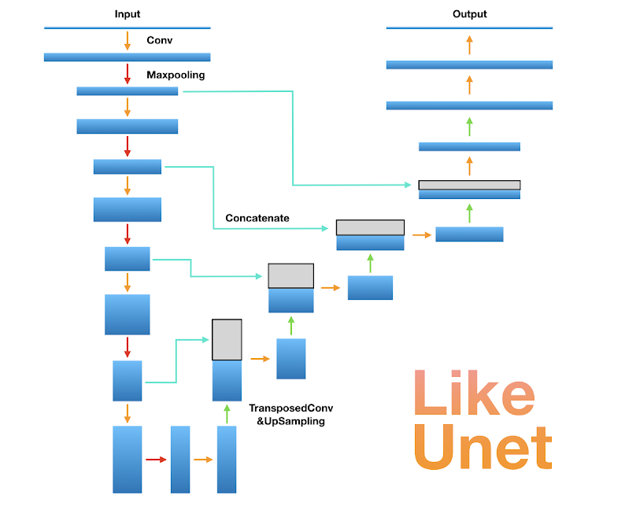

After most of the heavy work done by neural net, ***Haar Cascade Face Detection*** is used to locate the face, then crop and resize image to 256x256.

With proper tunning, we can turn left image (source: [google](https://www.google.com/url?sa=i&rct=j&q=&esrc=simg/&source=images&cd=&ved=2ahUKEwjDtLH6r8bmAhVDuZ4KHZIEAQ0QjRx6BAgBEAQ&url=http%3A%2F%2Fgoogle.com%2Fsearch%3Ftbm%3Disch%26q%3DTom%2BHardy&psig=AOvVaw3vUDgangqeFT4B_rP0YeQb&ust=1577005104844476)) into right one.

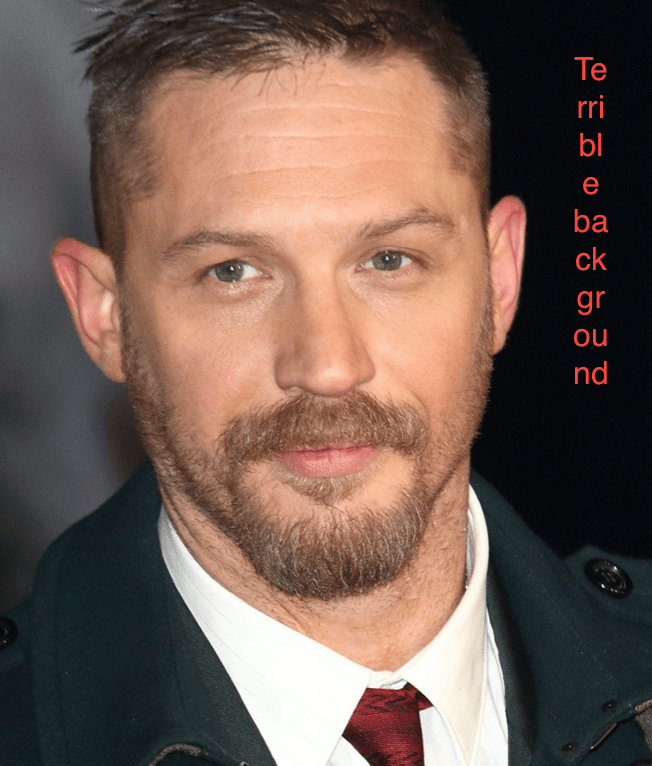 \\(\to\\) 

### Canny Edge Detection

Canny detector is provided by `Canny` in `opencv-python`.

One downside about Canny detector is that you have to set the two thresholds, and it's kinda a myth. So we use ***Otsu's Method for Image Thresholding***. In short, we group pixels into two sets by their intensity values and use the mean of the two sets as canny threshold. This will give us a cloud of points.

After edge detection, we have lots of points like this:

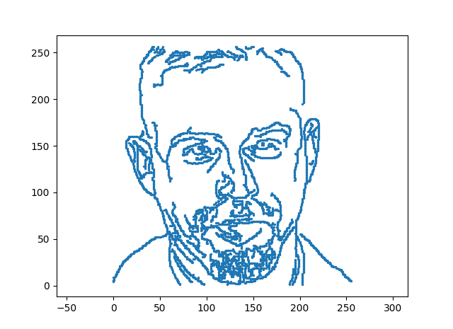

### Minimum Spanning Tree + Depth First Search

We use ***Prim's Algorithm*** to find the minimum spanning tree, for that we treat the canny detector output point cloud as a complete graph. Prim's algorithm is known to perform better on dense graphs compared to Kruskal's algorithm.

Once we have a tree, use ***Depth First Search*** to traverse all nodes and generate a PATH!

### Ramer-Douglas-Peucker Downsampling

Input parameters are a sequence of points, and the maximum tolerance \\(\epsilon\\) > 0.

<!-- ") -->
<figure>
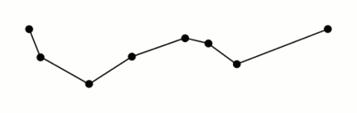
<figcaption>RDP Downsampling Illustration, source: <a href="https://en.wikipedia.org/wiki/Ramer%E2%80%93Douglas%E2%80%93Peucker_algorithm">Wikipedia</a></figcaption>
</figure>

Simply put, draw a line from start to end, find the point that is farthest from the line, if it's greater than \\(\epsilon\\), then keep it, otherwise discard it. Then recursively call the function with the first point and the farthest point, and the farthest point and the last point.

It may seem like a lot of work, but once you think "calculate points distance to the line" as "project points onto line and find the errors", it's just a matter of projection matrix and vector calculation, all good'ol linear algebra. Not only it's conceptually simpler, it also benefit from hardware acceleration! Our vectorized implementation shows 100x speedup compared to the naive one.

See how the path is simplified:

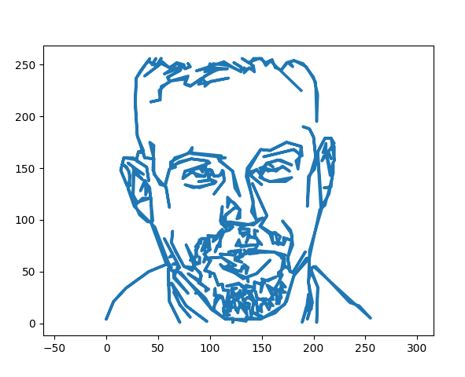

Once we have the path, we can feed it to the control algorithm.

$$	\downarrow \qquad	\downarrow \qquad	\downarrow \qquad	\downarrow \qquad	\downarrow $$

## Control

### Coordinate Transformation

For this part, we have to design a transformation method, with which the position of the joint angles can be conveniently calculated when the finger-tip are moving on a given x-y plane. This method should be precise and accessible when the robot arm are in a fixed gesture, and should guarantee that the gripper is in an unchangeable direction. Since the robot have to hold a pen and draw with in errors of millimeters, any deviation would destroy the painting. After we chose the arm gesture, we finished these steps:

1. Get the Cartesian coordinate from the input feature points of the picture. (Base frame)
2. Transform the Cartesian coordinate to polar coordinate. (Polar coordinate of Base frame)
3. Transform the polar coordinate to the joints space. (Joint space)

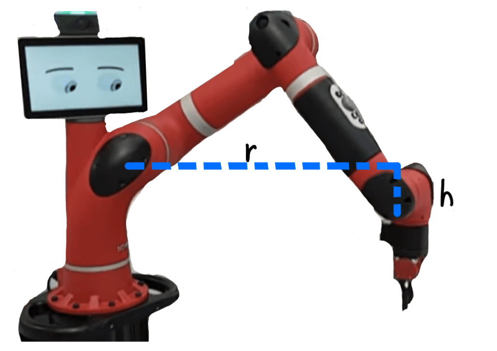
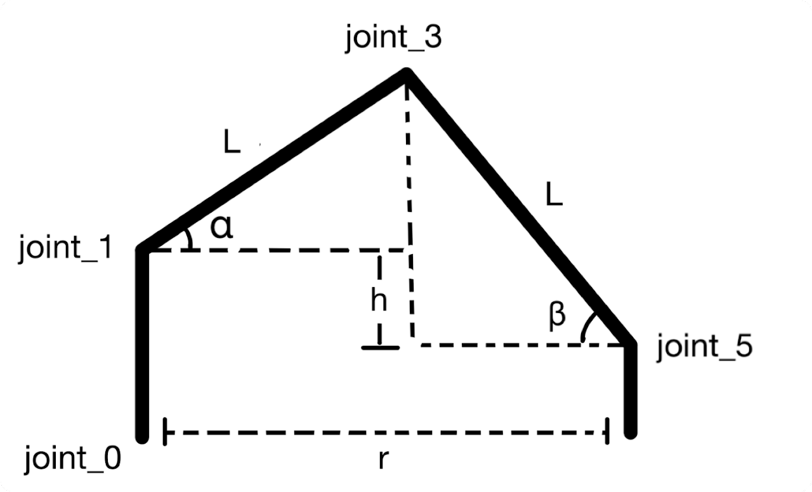

Since our task only needs to draw on a horizontal plan (the end of the gripper will stay in the plane orthogonal to z-axis), set the arm in the above gesture. Set joint_2, joint_4 and joint_6's angles always zero, which could cut down 3 degrees of freedom and save some calculation. Build a planar coordinate system to reflect the drawing plan. Using joint_1 as the origin of length, joint_0 as the origin of angle, construct a non-standard polar coordinate by which every position on the plane can be expressed. Obviously, set joint_0 = angle in polar coordinate, then use r and h to calculate other joints' angles.

To calculate the angles of other joints to represent the height and the length, we abstract the Sawyer into this 2-D model. By the geometric relation,

$$ r = L \times \cos(\alpha) + L \times \cos(\beta) $$
$$ h = L \times \sin(\beta) - L \times \sin(\alpha) $$

we can solve \\(\alpha = 2\tan^{-1}(\cdot) \\) and \\(\beta = 2\tan^{-1}(\cdot)\\) to represent all the information that \\(h\\) and \\(r\\) contain, and get all the angles in the joint space. With some error correction, we are good to go.

### Path Planning

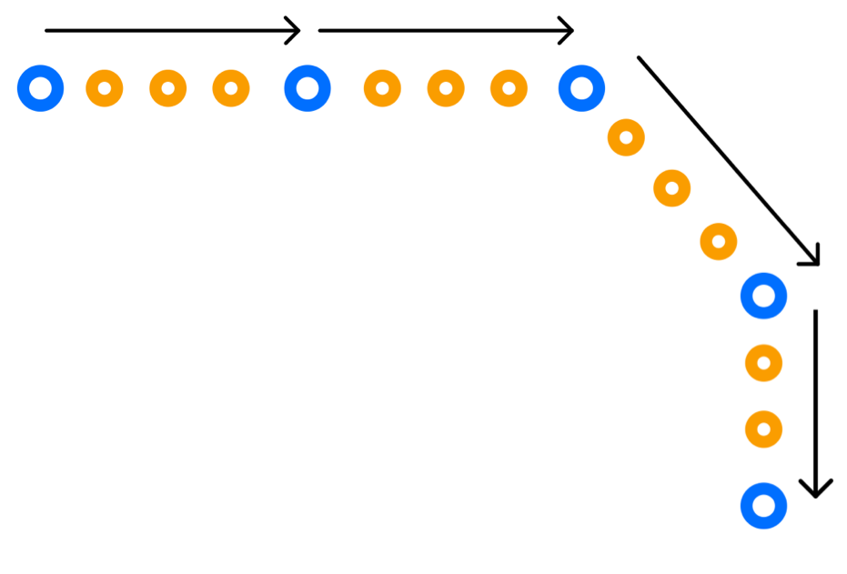

1. For each two adjacent input feature points(key points), insert several points between them.
2. Set a constant velocity in Cartesian coordinate.
3. For each two adjacent points, calculate the distance between them and the timestamps in Cartesian coordinate.
4. Using the positions in joint space and the timestamps to calculate the angular velocities of each joint.
5. Using RobotTrajectory.msg to save all the information and pass it to the PID controller.

In the end, we get a smooth path with consistent velocity. We were able to draw on a piece of paper with a pen attached to the end of the robot arm!

## Results


  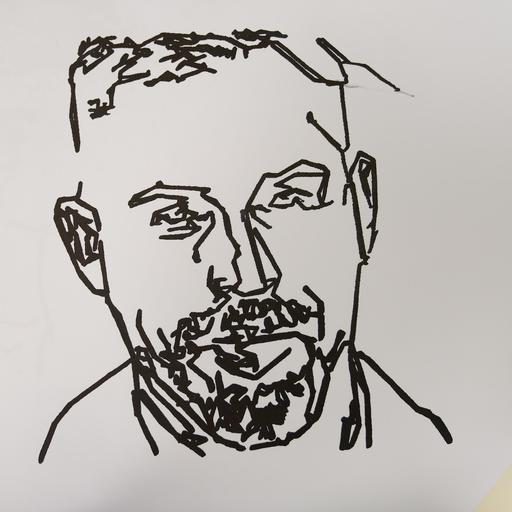
  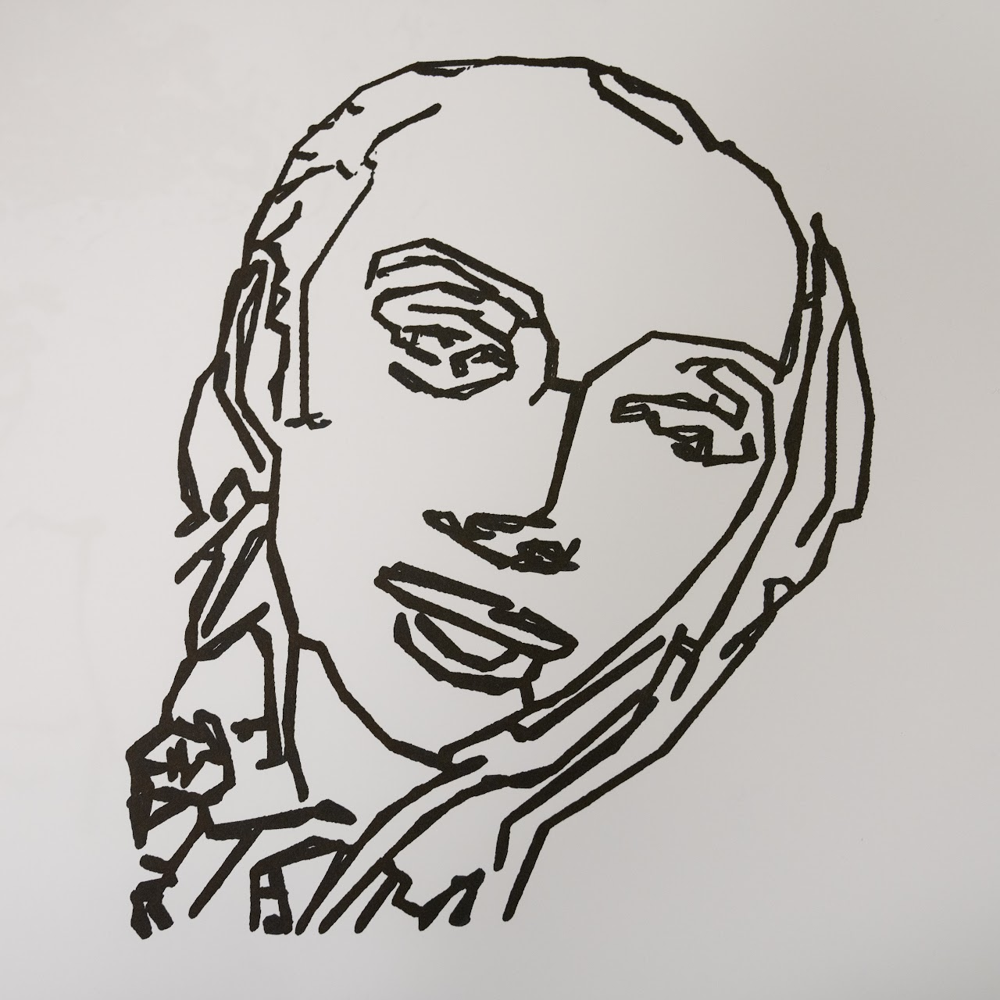
  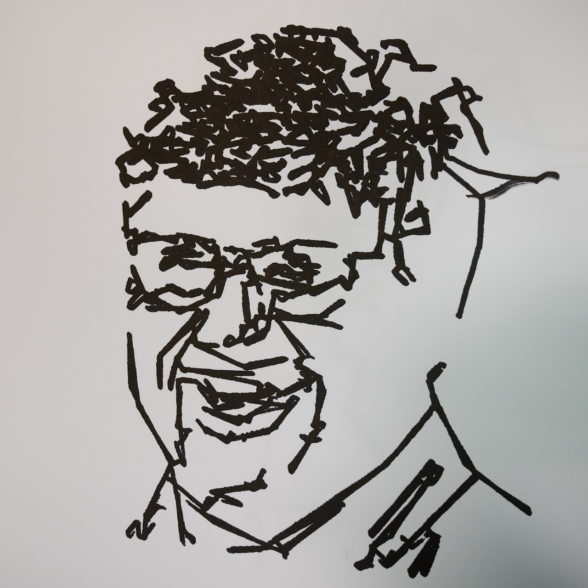


## Just Chillin'
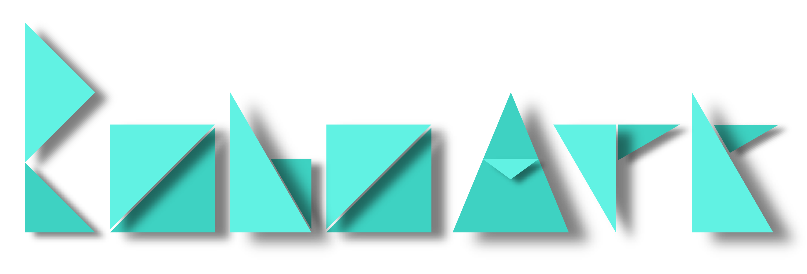


 

 

