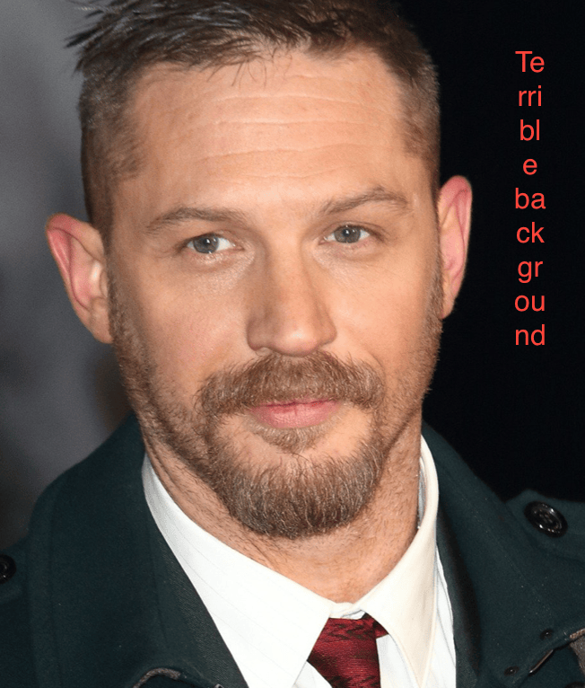
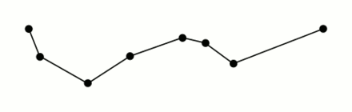
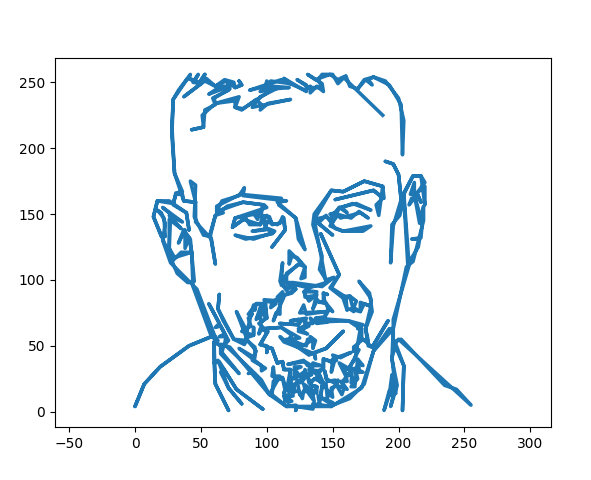
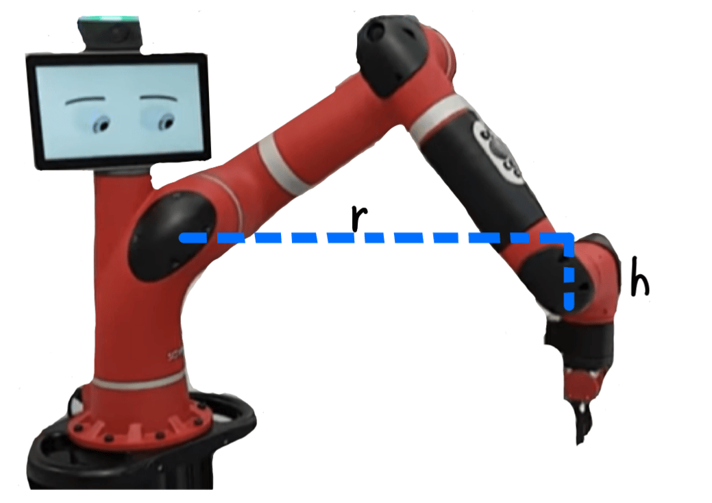
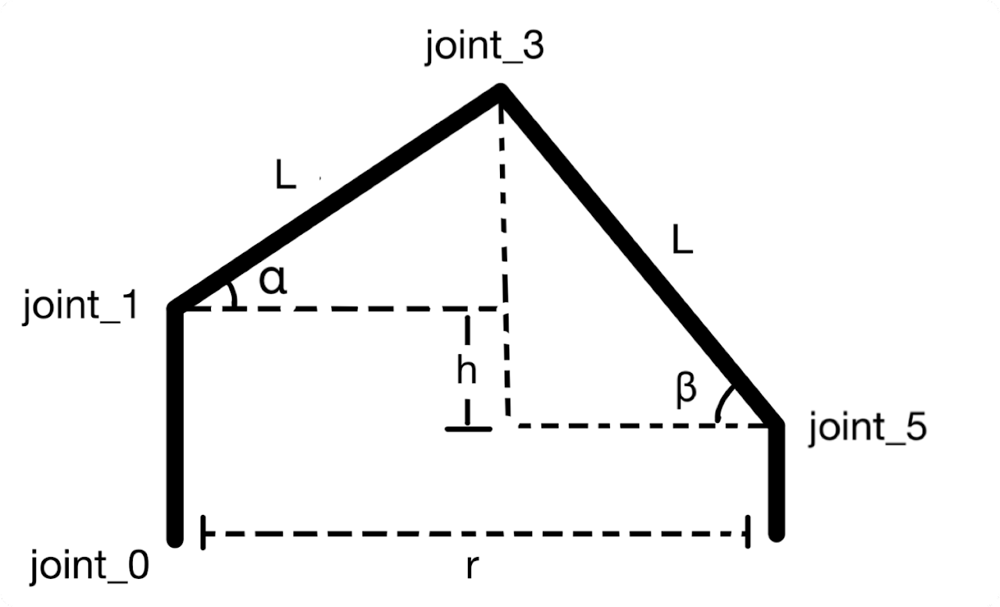
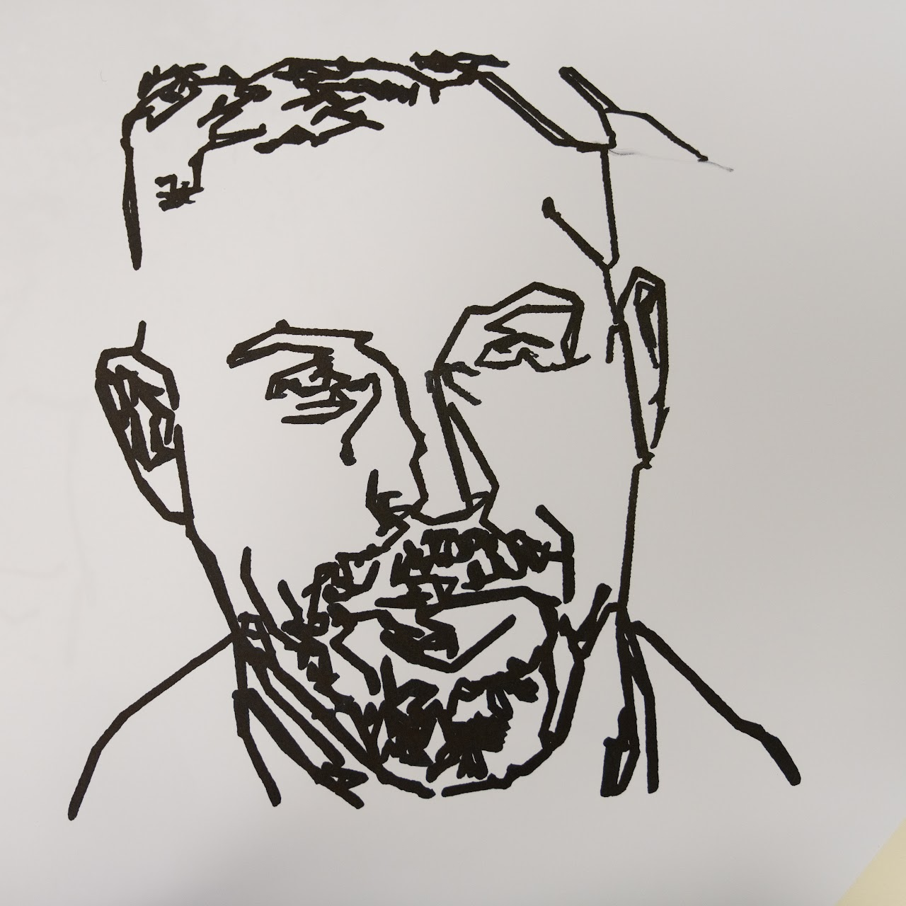
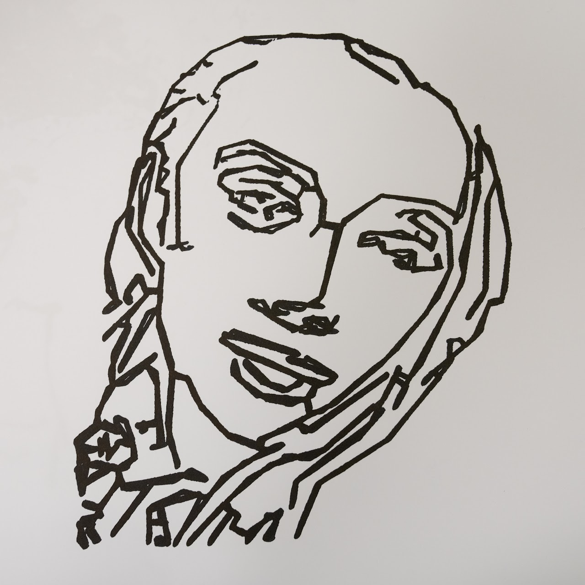
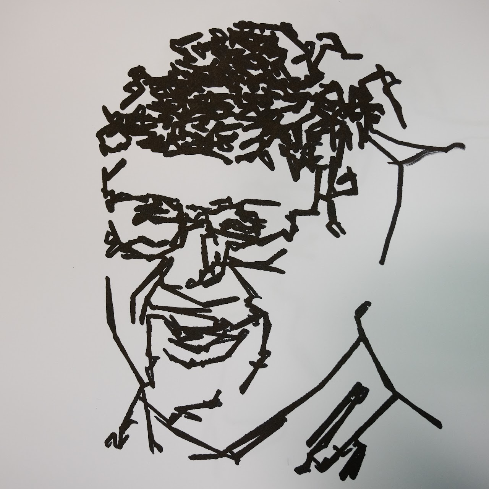




使一个六轴机器臂能够绘制肖像。


, Teng Xu, Ganlin Zhang, Ziyuan Hu, Weijie Lyu")

## 快速演示



## 视觉

视觉算法的目标是找到一条路径，一系列的2D点，机器臂按照这些点的顺序就能画出一张肖像。

我们的图像处理流程包括：

1. CNN人脸检测（生成256x256大小的人脸剪裁图像）
2. Canny边缘检测（提取图像中的所有边缘点）
3. 最小生成树 + 深度优先搜索（生成一条遍历所有边缘点的路径）
4. Ramer-Douglas-Peucher降采样（使用RDP降采样方法减少噪声）

### CNN人脸检测

我们训练了一个自定义的CNN用于语义人类抠图。

我们的网络设计和训练基于以下三篇论文：
- [U-Net: Convolutional Networks for Biomedical Image Segmentation](https://www.google.com/url?q=https%3A%2F%2Farxiv.org%2Fabs%2F1505.04597&sa=D&sntz=1&usg=AOvVaw2BS8Abhu7NmMBa017Rdjnr)
- [Fully Convolutional Networks for Semantic Segmentation](https://www.google.com/url?q=https%3A%2F%2Farxiv.org%2Fabs%2F1605.06211&sa=D&sntz=1&usg=AOvVaw3O5P7d2yu1NfT9Iu9bomUi)
- [ACNet: Strengthening the Kernel Skeletons for Powerful CNN via Asymmetric Convolution Blocks](https://www.google.com/url?q=https%3A%2F%2Farxiv.org%2Fabs%2F1908.03930&sa=D&sntz=1&usg=AOvVaw2odo-mX_7lgQI0Hy2N3KiT)

有了U-Net和FCN这样强大的工具，图像分割就变得相对容易了。由于我们不想花费长时间训练和使用巨大的模型，所以我们使用了类似U-Net的结构，但是卷积层和卷积核更少，同时更深一些。而且，它看起来效果很好。:winking_face:

在神经网络完成了大部分繁重的工作后，我们使用***Haar级联人脸检测***来定位脸部，然后将图像剪裁并调整为256x256的大小。

通过适当的调整，我们可以将左边的图像（来源：[google](https://www.google.com/url?sa=i&rct=j&q=&esrc=simg/&source=images&cd=&ved=2ahUKEwjDtLH6r8bmAhVDuZ4KHZIEAQ0QjRx6BAgBEAQ&url=http%3A%2F%2Fgoogle.com%2Fsearch%3Ftbm%3Disch%26q%3DTom%2BHardy&psig=AOvVaw3vUDgangqeFT4B_rP0YeQb&ust=1577005104844476)）转化为右边的图像。

 \\(\to\\) 

### Canny边缘检测

Canny检测器由`opencv-python`的`Canny`提供。

Canny检测器的一个缺点是你必须设置两个阈值，这有点神秘。所以我们使用***Otsu的图像阈值化方法***。简单来说，我们根据像素的强度值将像素分为两组，然后使用两组的均值作为canny阈值。这将给我们一堆点。

边缘检测后，我们得到了许多这样的点：

### 最小生成树 + 深度优先搜索

我们使用***Prim算法***找到最小生成树，我们将canny检测器输出的点云视为一个完全图。Prim算法在处理密集图时的性能优于Kruskal算法。

一旦我们得到了一棵树，就使用***深度优先搜索***遍历所有节点并生成一条路径！

### Ramer-Douglas-Peucker降采样

输入参数是一系列的点，和最大容忍度\\(\epsilon\\) > 0。

<figure>

<figcaption>RDP降采样示意图，来源：<a href="https://en.wikipedia.org/wiki/Ramer%E2%80%93Douglas%E2%80%93Peucker_algorithm">Wikipedia</a></figcaption>
</figure>

简单来说，从起点到终点画一条线，找到离线最远的点，如果它大于\\(\epsilon\\)，那么保留它，否则丢弃它。然后递归地调用函数，用第一个点和最远的点，以及最远的点和最后一个点。

这可能看起来很麻烦，但一旦你把"计算点到线的距离"想象成"将点投影到线上并找出误差"，这只是一个投影矩阵和向量计算的问题，都是线性代数的老朋友。不仅概念上更简单，而且还可以从硬件加速中受益！我们的向量化实现比原始方法快了100倍。

看看路径是如何被简化的：

一旦我们得到了路径，我们就可以将其输入到控制算法中。

$$	\downarrow \qquad	\downarrow \qquad	\downarrow \qquad	\downarrow \qquad	\downarrow $$

## 控制

### 坐标转换

对于这部分，我们需要设计一个转换方法，通过这个方法，当机器臂的指尖在给定的x-y平面上移动时，可以方便地计算关节角的位置。这个方法在机器臂处于固定姿态时应该精确且易于获取，并且应保证夹具的方向不变。因为机器人需要拿着一支笔在毫米级的误差范围内画图，任何偏差都会破坏画作。我们选择了臂部的姿态后，完成了以下步骤：

1. 从图片的输入特征点获取笛卡尔坐标（基座坐标）。
2. 将笛卡尔坐标转换为极坐标（基座极坐标）。
3. 将极坐标转换为关节空间（关节空间）。

由于我们的任务只需要在一个水平平面上绘画（夹具的端部将保持在与z轴正交的平面上），所以将臂部设定为上述姿态。将joint_2、joint_4和joint_6的角度始终设为零，这可以减少3个自由度并节省一些计算量。构建一个平面坐标系统来反映绘图计划。以joint_1为长度的原点，joint_0为角度的原点，构建一个非标准的极坐标系，通过它，平面上的每个位置都可以被表达出来。显然，将joint_0设为极坐标中的角度，然后使用r和h来计算其他关节的角度。

为了计算其他关节的角度以表示高度和长度，我们将Sawyer抽象为这个2-D模型。通过几何关系，

$$ r = L \times \cos(\alpha) + L \times \cos(\beta) $$
$$ h = L \times \sin(\beta) - L \times \sin(\alpha) $$

我们可以解出\\(\alpha = 2\tan^{-1}(\cdot) \\) 和 \\(\beta = 2\tan^{-1}(\cdot)\\) 来表示所有\\(h\\) 和 \\(r\\) 所包含的信息，并获取关节空间中的所有角度。在做了一些误差校正后，我们就可以开始了。

### 路径规划

1. 对于每两个相邻的输入特征点（关键点），在它们之间插入几个点。
2. 在笛卡尔坐标中设定一个恒定的速度。
3. 对于每两个相邻的点，计算它们之间的距离和笛卡尔坐标中的时间戳。
4. 使用关节空间中的位置和时间戳来计算每个关节的角速度。
5. 使用RobotTrajectory.msg保存所有信息并传递给PID控制器。

最后，我们得到了一条平滑且速度一致的路径。我们能够在一张纸上绘画，笔就附在机器臂的末端！

## 结果


  
  
  


## 休息一下


 

 

