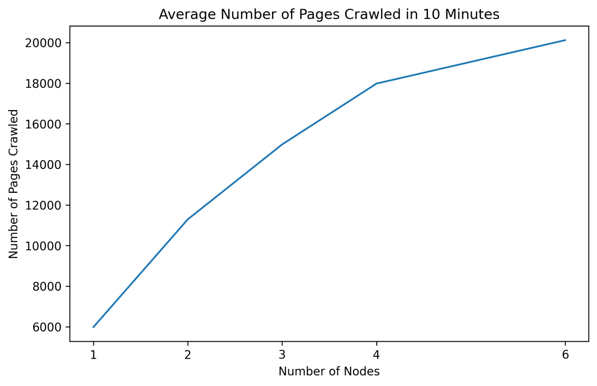



## Overview

The goal of this project is to build a distributed Web indexer/crawler and analyze its performance. This will involve four major components, each of which is loosely coupled with the others:
- Crawler
- Indexer/TF-IDF Retrieval Engine
- PageRank
- Search Engine and User Interface


All these components have an independent interface and communicate through databases. We also implement the following extra credit tasks:
- Crawler can handle non-html data
- Crawler can store partial metadata about the web documents
- Search engine utilizes document metadata in order to provide improved ranking

We built a distributed crawler based on the thread pool and event loop concurrent programming, organized in microservices fashion adopted form Apache Storm, and deployed to distributed servers using Docker Swarm or Kubernetes. As for the indexer, we use AWS Elastic MapReduce (EMR) to generate the data structures from the output of the crawler and store the resulting index data persistently across multiple nodes using DynamoDB. In the PageRank section, link analysis is performed through the PageRank algorithm. We also use Elastic MapReduce to run the job. We use SparkJava to develop route handlers for the search engine and web user interface and use React.js to build the frontend.

## Database

We use AWS DynamoDB as the database system because of its scalability and schemalessness. We use three tables in total as specified below.
- `DOCUMENT`: uses md5 as the partition key and contains two attributes, date and document.
- `URL`: uses url as the partition key and contains a global secondary index md5-weight-index which uses md5 as the partition key and weight as the sort key. The table also has attributes date and
outboundLinks.
- `INVIDX`: uses word as the partition key and md5 as the sort key. It also has a local secondary index
that uses tfidf as the sorted key and md5 as the projected attribute.
Splitting urls and documents to different tables allows us to map multiple urls to a single document without compromising our pagerank algorithm.

## Distributed Crawler



We built a distributed crawler based on the thread pool and event loop concurrent programming, and deployed to distributed servers using docker swarm. Threading and event loop asynchronous upload provides us with optimal speed for crawler on each single machine, and docker swarm provides us with easy and seamless scaling and deployment to multiple machines. We crawled 1.2M documents in total and they are available at the `DOCUMENT` table.

### Multi-threading and Asynchronous Operations on a Single Machine


The diagram above demonstrates our design for a single thread. Inspired by Spark Streaming, we emulate streaming processing by using mini-batches of data, and do map-reduce-like operations on them. The batch size limit of our distributed message queue Amazon SQS is 10, and the batch size limit of our database DynamoDB is 25. So we choose a Least Common Multiple 50 as our mini-batch size to fully utilize the batch download and upload capability provided by the queuing and database service. The critical path for a single iteration is to get urls, get documents from the internet, parse and extract links. Uploading the data is not in the critical path, so we simply run it asynchronously on the backend to prevent the upload network IO from blocking and threading and losing performance. We could further optimize the get and fetch documents from the internet part of our pipeline using a pre-fetch buffer, or we could simply launch multiple threads running this pipeline to compensate for the IO delay and improve the CPU utilization.

### Crawler Deployment

All the crawler instances on all the machines share the same url queue and database, so scaling the container size, then we deployed our containerized crawler like a service. It will spread evenly on all worker nodes, provides centralized control and status report over all instances, and it will automatically restart and recover the state of the container if any container error occurs or worker node dies. In this way, we achieved fast and robust distributed crawling.

### Distributed Message Queue and Deduplication


For the distributed message queue, we simply adopted the Amazon Simple Queue Service. It is a reliable message queue for queuing the urls during crawling. Currently we are doing deduplication within each crawler is very natural. Running multiple crawler instances on all the machines, then it is distributed. But such a simple way of distributing inevitably brings us many downsides. We don’t have a centralized control over all the crawler instances; we have to manually distribute crawlers; and most importantly, we have zero to none fault tolerance. Our solution is to use docker swarm orchestration. Much like the kubernetes orchestration, docker swarm provides us with a simple set of functionality and a native docker interface which allows us to quickly adapt to it. We containerized our crawler using docker multi-stage build to save crawler instance, and rely on the Amazon SQS FIFO deduplication. However, it has certain limitations. The number of duplications will be as large as the number of crawler instances we open. Once we really scale up our crawler to hundreds or thousands, we would have thousands of duplicate urls inside the url queue, which could easily lead to the explosion of number of items given the size of the internet and ultimately causing too much strain on the distributed queuing system and leading to failure. We designed the message deduplication service as a standalone service to help lighten the load of the queuing system. It receives the urls output from the crawler, and does a modulus hash of the url to determine which deduplication instance each url will be sent to. For each dedup instance we are using bloom filters as a functioning unit. We can now scale the deduplication service as our crawler scales. In this way we have an extremely high probability of achieving exactly one computation.

### Efficiency

Apart from the design of our crawler, we also embedded several utility features in our document fetching and parsing. For the robots.txt rules of each domain, we use a LRU cache to store them, avoiding having to send too many get requests to the robots rules url. For non-HTML documents, we convert them into byte input streams and parse them using Apache Tika. Tika provides an amazing tool for parsing PDF, pictures and all other file types. It also can determine the language, allowing us to only store English content.

For the crawler, as it was given more nodes, the rate at which it crawled and downloaded increased greatly. Specifically, we were able to crawl 20000 documents in 10 minutes with 6 nodes. Below is a sketch performance testing results.



## Indexer/TF-IDF Retrieval Engine
We built a distributed indexer using the Elastic MapReduce framework that takes data collected by the crawler and creates an inverted index table. For each word we calculated the inverse document frequency (IDF) and term frequency-inverse document frequency (TF-IDF) and stored the values as two attributes in the `INVIDX` table. We implemented a MapReduce job to create the inverted indices for regular content and Metadata.

### Pre-processing
We first pre-process the document using techniques including lower-casing the text, Porter stemming, removing stop words and all-number words, and filtering special characters with Regex.

### Map
Input to the map phase is a key-value pair with md5 as the key and a single line of the file as the value. The value is the raw document. We used Jsoup to extract the raw HTML text. The mapper emits a tab separated key-value pair of a word and a md5 of the document that contains the word.

### Reduce
Inputs to the reduce phase are a query term and an iterable consisting of all the md5s corresponding to the document that contains the term. Job of the reducer is to compute the TF-IDF and IDF of the term and create a sorted inverted index list that corresponds to a single item in the table. The output of the MapReduce is a text file and we manually write the content to `INVIDX` table.

## PageRank
We built a distributed PageRank algorithm using the Elastic MapReduce framework that takes data collected by the crawler and assigns a score for each url. For each url we calculated its PageRank value based on its outbound urls and stored it in the `URL` table. We implemented a loop of MapReduce jobs to calculate the PageRank values until convergence (sum of difference between PageRank values between two consecutive iterations to be less than 0.01).

### Pre-processing
We pre-processed the outbound urls and removed the urls that do not appear as keys in the map phase. We also assign an initial value of 1 to each url.

### Map
Input to the map phase is a key-value pair with url (along with its current PageRank value) as the key and a list of its outbound urls as value. For each url, we divide its PageRank value equally and use this as the value associated with each outbound url key which is passed to the Reduce phase.

Experimentally, we found that intra-domain links result in unreasonably high PageRank values, and as a solution, we decided to penalize intra-domain outbound links by reducing their values by half, and increase the values of inter-domain outbound links accordingly so that their sum remains the same (the PageRank value of the originating url from the last iteration).

### Reduce
Inputs to the reduce phase are an url and a summable PageRank value associated with this url provided from its inbound urls in the Map phase. The Reduce phase sums those values up and produces the resulting PageRank value for the url. We incorporated a damping factor to address sinks:

$$ \text{PR}^{(i)}(x) = \alpha \sum_{j \in B(x)} \frac{1}{N_j} \text{PR}^{(i-1)}(j) + \beta
 $$

where the summation term is the sum described earlier, \\(\alpha = 0.85\\) is the damping factor, and \\(\beta = 0.15\\) is a constant.

## Search Engine and User Interface

We rank the URL based on both the raw content and metadata scores. We first calculate the cosine similarity of the query term and the words in the database with 4 threads. The cosine similarity between a query term and a word is \\(\frac{xy}{\sqrt{x^2+y^2}}\\) where x is the term TF-IDF and y is the word TF-IDF. We store the md5 and cosine similarity as a SimpleEntry in a heap. We then find term and title/metadata matches and store the top 50 matches to another heap with 4 threads. We prioritize ranking with title and metadata by extracting the top 50 results from the metadata heap first then consider ranking based on content matching. Given 50 entries of md5 and score, for each md5, we get the url with the highest PageRank score of the corresponding md5 from the URL table. The final ranking is computed as 0.6x + 0.4y where x is the indexer weight and y is the PageRank score. We rank the urls according to this score with a heap and extract the required content of the web page with Jsoup to formulate the JSON string.

### Cache with BerkeleyDB
We compose the search result to a JSON string and save it to cache with BerkeleyDB. Below is an example
of the JSON string.

```json
{
  "searchInformation": {
    "formattedSearchTime": "0.35",
    "formattedTotalResults": "1,520,000,000"
  },
  "items": [
    {
      "title": "Google Earth",
      "link": "https://www.google.com/earth/index.html",
      "displayLink": "www.google.com",
      "snippet": "The world's most detailed globe. Climb the tallest mountains.Discover cities around the world.Dive into the world's deepest canyons. Launch Earth…",
      "pagemap": {
        "cse_image": [
          {
            "src": "https://www.google.com/intl/en_us/earth/assets/static/images/studio_video_mobile_poster.png"
          }
        ]
      }
    }
  ]
}
```

The key of the map is the query term and the value is the JSON string. Whenever a user queries a term, the search engine checks whether it exists in the local cache. If so, it directly retrieves the JSON string and updates the search information fields and sends them to the frontend. As a result, it largely improves the query speed.

### User Interface

<figure>

<figcaption>From Google to Poogle (a little too similar perhaps)</figcaption>
</figure>

We develop the user interface as a replication of Google search engine using React.js. The frontend communicates with the backend through `/search`. We are able to display the url link, a snippet of the web page as well as the first image on the web page as search results. As mentioned before, we are able to display the top 50 results for a single query.

## Attribution
- Zhenzhong Tang: Crawler, Deployment
- Mengti Sun: Indexer, Ranking results, Frontend
- Lejun Jiang: PageRank
- Xitong Zheng: Indexer

And thanks to Mengti Sun for our Poogle logo, and DALL.E-3 for the beautiful background of the search engine (pretty cool, right?).


